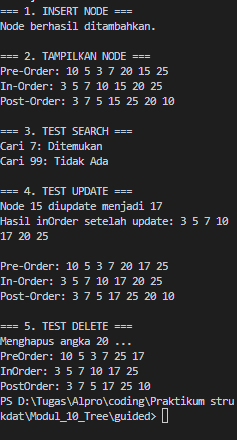
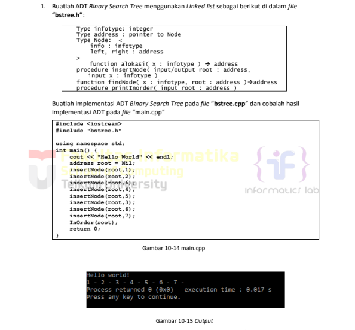
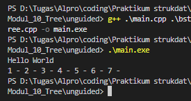
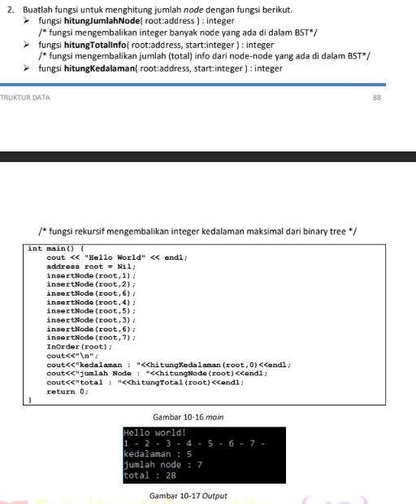
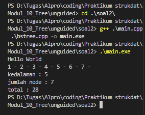
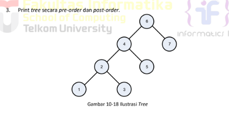
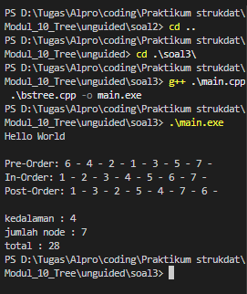

# <h1 align="center"> Laporan Praktikum Modul 10 <br> Tree </h1>
<p align="center">Rafi Maheswara - 103112400135</p>

## Dasar Teori

Tree adalah struktur data non-linear yang menggambarkan hubungan hierarkis antar elemen, mirip dengan struktur pohon terbalik atau silsilah keluarga.Dalam struktur ini, elemen paling atas disebut root (akar), yang menjadi titik awal percabangan ke elemen-elemen di bawahnya yang disebut child (anak). Setiap elemen (node) dihubungkan oleh garis (edge), dan node yang tidak lagi memiliki percabangan di bagian paling bawah disebut leaf (daun). Dalam pemrograman C++, tree sangat berguna untuk mengelola data yang memiliki tingkatan, seperti struktur folder dalam komputer, serta memungkinkan proses pencarian dan penyisipan data yang lebih efisien dibandingkan struktur data linear seperti array.

## Guided

### soal 1 

```C++
#include <iostream>
using namespace std;

struct Node {
    int data;
    Node *kiri, *kanan;
}; 

Node *buatNode(int nilai) {
    Node *baru = new Node;
    baru->data = nilai;
    baru->kiri = baru->kanan = NULL;
    return baru;
}

Node *insert(Node *root, int nilai) {
    if (root == NULL) {
        return buatNode(nilai);
    }
    if (nilai < root->data) {
        root->kiri = insert(root->kiri, nilai);
    } else {
        root->kanan = insert(root->kanan, nilai);
    }
    return root;
}

Node *search(Node *root, int nilai) {
    if (root == NULL || root->data == nilai) {
        return root;
    }
    if (nilai < root->data) {
        return search(root->kiri, nilai);
    }
    return search(root->kanan, nilai);
}

Node *nilaiTerkecil(Node *node) {
    Node *current = node;
    while (current && current->kiri != NULL) {
        current = current->kiri;
    }
    return current;
}

Node *hapus(Node *root, int nilai) {
    if (root == NULL) {
        return root;
    }
    if (nilai < root->data) {
        root->kiri = hapus(root->kiri, nilai);
    } else if (nilai > root->data) {
        root->kanan = hapus(root->kanan, nilai);
    } else {
        if (root->kiri == NULL) {
            Node *temp = root->kanan;
            delete root;
            return temp;
        } else if (root->kanan == NULL) {
            Node *temp = root->kiri;
            delete root;
            return temp;
        }
        Node *temp = nilaiTerkecil(root->kanan);
        root->data = temp->data;
        root->kanan = hapus(root->kanan, temp->data);
    }
    return root;
}

Node *update(Node *root, int lama, int baru) {
    if (search(root, lama) != NULL) { 
        root = hapus(root, lama);
        root = insert(root, baru);
        cout << "Node " << lama << " diupdate menjadi " << baru << endl;
    }
    else {
        cout << "Node " << lama << " tidak ditemukan." << endl;
    }
    return root;
}

void preOrder(Node *root) {  
    if (root != NULL) {
        cout << root->data << " ";
        preOrder(root->kiri);
        preOrder(root->kanan);
    }
}

void inOrder(Node *root) {  
    if (root != NULL) {
        inOrder(root->kiri);
        cout << root->data << " ";
        inOrder(root->kanan);
    }
}

void postOrder(Node *root) {  
    if (root != NULL) {
        postOrder(root->kiri);
        postOrder(root->kanan);
        cout << root->data << " ";
    }
}

int main() {  
    Node *root = NULL;
    cout << "=== 1. INSERT NODE ===" << endl;
    root = insert(root, 10);
    root = insert(root, 5);      
    root = insert(root, 20);     
    root = insert(root, 3);      
    root = insert(root, 7);      
    root = insert(root, 15);     
    root = insert(root, 25);     
    cout << "Node berhasil ditambahkan." << endl;

    cout << "\n=== 2. TAMPILKAN NODE ===" << endl;
    cout << "Pre-Order: ";
    preOrder(root);
    cout << endl;

    cout << "In-Order: ";
    inOrder(root);
    cout << endl;

    cout << "Post-Order: ";
    postOrder(root);
    cout << endl;

    cout << "\n=== 3. TEST SEARCH ===" << endl;
    int cari1 = 7, cari2 = 99;
    cout << "Cari " << cari1 << ": " << (search(root, cari1) ? "Ditemukan" : "Tidak Ada") << endl; 
    cout << "Cari " << cari2 << ": " << (search(root, cari2) ? "Ditemukan" : "Tidak Ada") << endl; 
    
    cout << "\n=== 4. TEST UPDATE ===" << endl;
    root = update(root, 15, 17);
    cout << "Hasil inOrder setelah update: ";  
    inOrder(root);
    cout << endl;

    cout << "\nPre-Order: ";
    preOrder(root);
    cout << endl;
    cout << "In-Order: ";
    inOrder(root);
    cout << endl;
    cout << "Post-Order: ";
    postOrder(root);
    cout << endl;
    
    cout << "\n=== 5. TEST DELETE ===" << endl;
    cout << "Menghapus angka 20 ..." << endl;
    root = hapus(root, 20); 

    cout << "PreOrder: ";
    preOrder(root);
    cout << endl;
    cout << "InOrder: ";
    inOrder(root);
    cout << endl;   
    cout << "PostOrder: ";
    postOrder(root);
    cout << endl;
    
    return 0;
}

```
> 

program ini mendemonstrasikan siklus lengkap manipulasi data BST, dimulai dengan penyisipan node yang dikonfirmasi oleh tampilan In-Order yang terurut rapi dari 3 hingga 25. Pengujian fungsi Search sukses mendeteksi keberadaan angka 7 dan ketiadaan 99, diikuti oleh operasi Update yang mengganti 15 menjadi 17 sembari menjaga urutan data tetap valid. Terakhir, eksekusi Delete pada node 20 membuktikan algoritma penataan ulang otomatis bekerja, di mana node tersebut dihapus dan digantikan oleh anak kanannya (25), menghasilkan struktur akhir pohon yang tetap terintegrasi tanpa merusak hierarki data.

## Unguided

### Soal 1

> 

#### bstree.h
```C++
#ifndef BSTREE_H
#define BSTREE_H

#include <iostream>
using namespace std;

typedef int infotype;
typedef struct Node* address;

struct Node {
    infotype info;
    address left;
    address right;
};

address alokasi(infotype x);
void insertNode(address &root, infotype x);
void inOrder(address root);
address findNode(infotype x, address root);
void printInOrder(address root);

#endif
```

#### bstree.cpp
```C++
#include "bstree.h"

address alokasi(infotype x) {
    address newNode = new Node;
    newNode->info = x;
    newNode->left = NULL;
    newNode->right = NULL;
    return newNode;
}

void insertNode(address &root, infotype x) {
    if (root == NULL) {
        root = alokasi(x);
    } else {
        if (x < root->info) {
            insertNode(root->left, x);
        } else if (x > root->info) {
            insertNode(root->right, x);
        }
    }
}

void inOrder(address root) {
    if (root != NULL) {
        inOrder(root->left);        
        cout << root->info << " - "; 
        inOrder(root->right);       
    }
}

address findNode(infotype x, address root) {
    if (root == NULL) {
        return NULL;
    } else if (x == root->info) {
        return root;
    } else if (x < root->info) {
        return findNode(x, root->left);
    } else {
        return findNode(x, root->right);
    }
}

void printInOrder(address root) {
    inOrder(root);
    cout << endl;
}
```

#### main.cpp
```C++
#include <iostream>
#include "bstree.h"

using namespace std;

int main() {
    cout << "Hello World" << endl;
    
    address root = NULL;
    
    insertNode(root, 1);
    insertNode(root, 2);
    insertNode(root, 3);
    insertNode(root, 4);
    insertNode(root, 5);
    insertNode(root, 6);
    insertNode(root, 7);
    
    inOrder(root);
    
    return 0;
}
```

> Output
> 

program memasukkan angka 1 hingga 7 secara berurutan ke dalam BST, yang menghasilkan struktur tree condong ke kanan karena setiap nilai baru lebih besar dari nilai sebelumnya sehingga selalu dimasukkan ke anak kanan. Ketika fungsi inOrder dipanggil, program melakukan traversal in-order yang mengunjungi subtree kiri, node saat ini, kemudian subtree kanan, menghasilkan output 1 - 2 - 3 - 4 - 5 - 6 - 7 - yang menampilkan semua nilai dalam urutan menaik sesuai sifat traversal in-order pada BST.

### Soal 2

> 

#### bstree.h
```C++
#ifndef BSTREE_H
#define BSTREE_H

#include <iostream>
using namespace std;

typedef int infotype;
typedef struct Node* address;

struct Node {
    infotype info;
    address left;
    address right;
};

address alokasi(infotype x);
void insertNode(address &root, infotype x);
void inOrder(address root);
address findNode(infotype x, address root);
void printInOrder(address root);

int hitungJumlahNode(address root);
int hitungTotalInfo(address root, int start);
int hitungKedalaman(address root, int start);

#endif
```

#### bstree.cpp
```C++
#include "bstree.h"

address alokasi(infotype x) {
    address newNode = new Node;
    newNode->info = x;
    newNode->left = NULL;
    newNode->right = NULL;
    return newNode;
}

void insertNode(address &root, infotype x) {
    if (root == NULL) {
        root = alokasi(x);
    } else {
        if (x < root->info) {
            insertNode(root->left, x);
        } else if (x > root->info) {
            insertNode(root->right, x);
        }
    }
}

void inOrder(address root) {
    if (root != NULL) {
        inOrder(root->left);        
        cout << root->info << " - "; 
        inOrder(root->right);       
    }
}

address findNode(infotype x, address root) {
    if (root == NULL) {
        return NULL;
    } else if (x == root->info) {
        return root;
    } else if (x < root->info) {
        return findNode(x, root->left);
    } else {
        return findNode(x, root->right);
    }
}

void printInOrder(address root) {
    inOrder(root);
    cout << endl;
}
int hitungJumlahNode(address root) {
    if (root == NULL) {
        return 0;
    } else {
        return 1 + hitungJumlahNode(root->left) + hitungJumlahNode(root->right);
    }
}

int hitungTotalInfo(address root, int start) {
    if (root == NULL) {
        return start;
    } else {
        start = start + root->info;
        start = hitungTotalInfo(root->left, start);
        start = hitungTotalInfo(root->right, start);
        return start;
    }
}

int hitungKedalaman(address root, int start) {
    if (root == NULL) {
        return start;
    } else {
        int kedalamanKiri = hitungKedalaman(root->left, start + 1);
        int kedalamanKanan = hitungKedalaman(root->right, start + 1);
        
        if (kedalamanKiri > kedalamanKanan) {
            return kedalamanKiri;
        } else {
            return kedalamanKanan;
        }
    }
}
```

#### main.cpp
```C++
#include <iostream>
#include "bstree.h"

using namespace std;

int main() {
    cout << "Hello World" << endl;
    address root = NULL;
    
    insertNode(root, 1);
    insertNode(root, 2);
    insertNode(root, 6);
    insertNode(root, 4);
    insertNode(root, 5);
    insertNode(root, 3);
    insertNode(root, 6);
    insertNode(root, 7);
    
    inOrder(root);
    cout << endl;
    
    cout << "kedalaman : " << hitungKedalaman(root, 0) << endl;
    cout << "jumlah node : " << hitungJumlahNode(root) << endl;    
    cout << "total : " << hitungTotalInfo(root, 0) << endl;
    return 0;
}
```

> Output
> 

 program memasukkan angka 1, 2, 6, 4, 5, 3, 6 (duplikat diabaikan), dan 7 ke dalam BST. Fungsi hitungJumlahNode menghitung total node dengan rekursi yang menjumlahkan 1 ditambah jumlah node di subtree kiri dan kanan. Fungsi hitungTotalInfo menjumlahkan semua nilai info dalam tree secara rekursif dengan parameter akumulator start. Fungsi hitungKedalaman menghitung kedalaman maksimum tree dengan membandingkan kedalaman subtree kiri dan kanan, kemudian mengembalikan yang lebih besar. Output program menampilkan traversal in-order 1 - 2 - 3 - 4 - 5 - 6 - 7 -, kedalaman tree, jumlah total node (7 node karena angka 6 duplikat tidak dimasukkan), dan total penjumlahan semua nilai info dalam tree yaitu 28

### Soal 3

> 

#### bstree.h
```C++
#ifndef BSTREE_H
#define BSTREE_H

#include <iostream>
using namespace std;

typedef int infotype;
typedef struct Node* address;

struct Node {
    infotype info;
    address left;
    address right;
};

address alokasi(infotype x);
void insertNode(address &root, infotype x);
void inOrder(address root);
address findNode(infotype x, address root);
void printInOrder(address root);

int hitungJumlahNode(address root);
int hitungTotalInfo(address root, int start);
int hitungKedalaman(address root, int start);

void preOrder(address root);
void postOrder(address root);
void printPreOrder(address root);
void printPostOrder(address root);

#endif
```

#### bstree.cpp
```C++
#include "bstree.h"

address alokasi(infotype x) {
    address newNode = new Node;
    newNode->info = x;
    newNode->left = NULL;
    newNode->right = NULL;
    return newNode;
}

void insertNode(address &root, infotype x) {
    if (root == NULL) {
        root = alokasi(x);
    } else {
        if (x < root->info) {
            insertNode(root->left, x);
        } else if (x > root->info) {
            insertNode(root->right, x);
        }
    }
}

void inOrder(address root) {
    if (root != NULL) {
        inOrder(root->left);        
        cout << root->info << " - "; 
        inOrder(root->right);       
    }
}

address findNode(infotype x, address root) {
    if (root == NULL) {
        return NULL;
    } else if (x == root->info) {
        return root;
    } else if (x < root->info) {
        return findNode(x, root->left);
    } else {
        return findNode(x, root->right);
    }
}

void printInOrder(address root) {
    inOrder(root);
    cout << endl;
}
int hitungJumlahNode(address root) {
    if (root == NULL) {
        return 0;
    } else {
        return 1 + hitungJumlahNode(root->left) + hitungJumlahNode(root->right);
    }
}

int hitungTotalInfo(address root, int start) {
    if (root == NULL) {
        return start;
    } else {
        start = start + root->info;
        start = hitungTotalInfo(root->left, start);
        start = hitungTotalInfo(root->right, start);
        return start;
    }
}

int hitungKedalaman(address root, int start) {
    if (root == NULL) {
        return start;
    } else {
        int kedalamanKiri = hitungKedalaman(root->left, start + 1);
        int kedalamanKanan = hitungKedalaman(root->right, start + 1);
        
        if (kedalamanKiri > kedalamanKanan) {
            return kedalamanKiri;
        } else {
            return kedalamanKanan;
        }
    }
}

void preOrder(address root) {
    if (root != NULL) {
        cout << root->info << " - "; 
        preOrder(root->left);        
        preOrder(root->right);       
    }
}

void postOrder(address root) {
    if (root != NULL) {
        postOrder(root->left);       
        postOrder(root->right);      
        cout << root->info << " - "; 
    }
}

void printPreOrder(address root) {
    preOrder(root);
    cout << endl;
}
void printPostOrder(address root) {
    postOrder(root);
    cout << endl;
}
```

#### main.cpp
```C++
#include <iostream>
#include "bstree.h"

using namespace std;

int main() {
    cout << "Hello World" << endl;
    
    address root = NULL;
    
    insertNode(root, 6);
    insertNode(root, 4);
    insertNode(root, 7);
    insertNode(root, 2);
    insertNode(root, 5);
    insertNode(root, 1);
    insertNode(root, 3);
    
    cout << "\nPre-Order: ";
    printPreOrder(root);
    
    cout << "In-Order: ";
    printInOrder(root);
    
    cout << "Post-Order: ";
    printPostOrder(root);
    
    cout << "\nkedalaman : " << hitungKedalaman(root, 0) << endl;
    cout << "jumlah node : " << hitungJumlahNode(root) << endl;
    cout << "total : " << hitungTotalInfo(root, 0) << endl;
    
    return 0;
}
```

> Output
> 

program memasukkan angka 6, 4, 7, 2, 5, 1, 3 ke dalam BST dimana 6 menjadi root, 4 dan 7 sebagai anak kiri dan kanan root, kemudian node-node lainnya diatur sesuai aturan BST. Output program menampilkan "Hello World" diikuti hasil traversal pre-order yang mengunjungi node saat ini terlebih dahulu kemudian subtree kiri dan kanan menghasilkan urutan 6 - 4 - 2 - 1 - 3 - 5 - 7 -. Traversal in-order mengunjungi subtree kiri, node saat ini, lalu subtree kanan menghasilkan urutan terurut 1 - 2 - 3 - 4 - 5 - 6 - 7 -. Traversal post-order mengunjungi subtree kiri dan kanan terlebih dahulu baru node saat ini menghasilkan 1 - 3 - 2 - 5 - 4 - 7 - 6 -. Program juga menampilkan kedalaman tree yaitu 3 (dari root ke node paling dalam), jumlah node sebanyak 7, dan total penjumlahan semua nilai info adalah 28.
## Referensi

1. Wisesty, U. N., Nurrahmi, H., Yunanto, P. E., Rismala, R., & Sthevanie, F. (2025). STRUKTUR DATA MENGGUNAKAN C++. PENERBIT KBM INDONESIA. https://books.google.com/books?hl=en&lr=&id=JwCTEQAAQBAJ&oi=fnd&pg=PA157&dq=tree+bahasa+cpp&ots=Wt5zLl_j_k&sig=NxhKxZJodN_8PxFVplIORN62y78
2. Anita Sindar, R. M. S. (2019). Struktur Data Dan Algoritma Dengan C++ (Vol. 1). CV. AA. RIZKY. https://books.google.com/books?hl=en&lr=&id=GP_ADwAAQBAJ&oi=fnd&pg=PA23&dq=stack+pada+c%2B%2B&ots=86k4Nl2OhV&sig=0KNR8rE2WYaLliEAZmi71x2eU7k
3. Santoso, L. E. (2004). STANDARD TEMPLATE LIBRARY C++ UNTUK MENGAJARKAN STRUKTUR DATA. Jurnal FASILKOM Vol, 2(2). https://www.academia.edu/download/56411324/standard-template-library-c__-untuk-mengajarkan-struktur-data.pdf