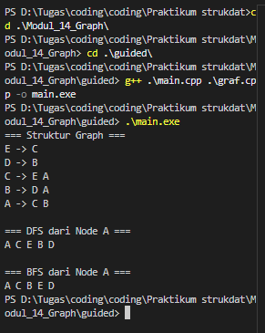
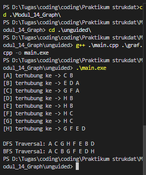

# <h1 align="center"> Laporan Praktikum Modul 12 <br> Graph </h1>
<p align="center">Rafi Maheswara - 103112400135</p>

## Dasar Teori

Graf merupakan struktur data non-linear yang sangat fleksibel untuk merepresentasikan hubungan kompleks antar objek. Secara mendasar, graf terbentuk dari sekumpulan titik yang disebut Vertex (Node) dan garis penghubung yang disebut Edge (Sisi). Hubungan ini memungkinkan graf menggambarkan sistem yang tidak bisa dijelaskan hanya dengan struktur linear seperti array atau stack. Berdasarkan arah hubungannya, graf dibedakan menjadi dua jenis utama, yaitu Undirected Graph, di mana hubungan antar simpul bersifat timbal balik atau dua arah, dan Directed Graph (Digraph), di mana hubungan memiliki arah tertentu yang biasanya digambarkan dengan anak panah.

## Guided

### soal 1 

#### graf.h

```C++
#ifndef GRAF_H_INCLUDED
#define GRAF_H_INCLUDED

#include <iostream>
using namespace std;

typedef char infoGraph;

struct ElmNode;
struct ElmEdge;

typedef ElmNode *adrNode;
typedef ElmEdge *adrEdge;

struct ElmNode
{
    infoGraph info;
    int visited;
    adrEdge firstEdge;
    adrNode next;
};

struct ElmEdge
{
    adrNode node;
    adrEdge next;
};

struct Graph
{
    adrNode first;
};

// PRIMITIF GRAPH
void CreateGraph(Graph &G);
adrNode AllocateNode(infoGraph X);
adrEdge AllocateEdge(adrNode N);

void InsertNode(Graph &G, infoGraph X);
adrNode FindNode(Graph G, infoGraph X);

void ConnectNode(Graph &G, infoGraph A, infoGraph B);

void PrintInfoGraph(Graph G);

// Traversal
void ResetVisited(Graph &G);
void PrintDFS(Graph &G, adrNode N);
void PrintBFS(Graph &G, adrNode N);

#endif

```
#### graf.cpp

```C++

#include "graf.h"
#include <queue>
#include <stack>

void CreateGraph(Graph &G)
{
    G.first = NULL;
}

adrNode AllocateNode(infoGraph X)
{
    adrNode P = new ElmNode;
    P->info = X;
    P->visited = 0;
    P->firstEdge = NULL;
    P->next = NULL;
    return P;
}

adrEdge AllocateEdge(adrNode N)
{
    adrEdge P = new ElmEdge;
    P->node = N;
    P->next = NULL;
    return P;
}

void InsertNode(Graph &G, infoGraph X)
{
    adrNode P = AllocateNode(X);
    P->next = G.first;
    G.first = P;
}

adrNode FindNode(Graph G, infoGraph X)
{
    adrNode P = G.first;
    while (P != NULL)
    {
        if (P->info == X)
            return P;
        P = P->next;
    }
    return NULL;
}

void ConnectNode(Graph &G, infoGraph A, infoGraph B)
{
    adrNode N1 = FindNode(G, A);
    adrNode N2 = FindNode(G, B);

    if (N1 == NULL || N2 == NULL)
    {
        cout << "Node tidak ditemukan!\n";
        return;
    }

    // Buat edge dari N1 ke N2
    adrEdge E1 = AllocateEdge(N2);
    E1->next = N1->firstEdge;
    N1->firstEdge = E1;

    // Karena undirected → buat edge balik
    adrEdge E2 = AllocateEdge(N1);
    E2->next = N2->firstEdge;
    N2->firstEdge = E2;
}

void PrintInfoGraph(Graph G)
{
    adrNode P = G.first;
    while (P != NULL)
    {
        cout << P->info << " -> ";
        adrEdge E = P->firstEdge;
        while (E != NULL)
        {
            cout << E->node->info << " ";
            E = E->next;
        }
        cout << endl;
        P = P->next;
    }
}

void ResetVisited(Graph &G)
{
    adrNode P = G.first;
    while (P != NULL)
    {
        P->visited = 0;
        P = P->next;
    }
}

void PrintDFS(Graph &G, adrNode N)
{
    if (N == NULL)
        return;

    N->visited = 1;
    cout << N->info << " ";

    adrEdge E = N->firstEdge;
    while (E != NULL)
    {
        if (E->node->visited == 0)
        {
            PrintDFS(G, E->node);
        }
        E = E->next;
    }
}

void PrintBFS(Graph &G, adrNode N)
{
    if (N == NULL)
        return;

    queue<adrNode> Q;
    Q.push(N);

    while (!Q.empty())
    {
        adrNode curr = Q.front();
        Q.pop();

        if (curr->visited == 0)
        {
            curr->visited = 1;
            cout << curr->info << " ";

            adrEdge E = curr->firstEdge;
            while (E != NULL)
            {
                if (E->node->visited == 0)
                {
                    Q.push(E->node);
                }
                E = E->next;
            }
        }
    }
}

```
#### main.cpp

```C++

#include "graf.h"
#include <iostream>
using namespace std;

int main()
{
    Graph G;
    CreateGraph(G);

    // Tambah node
    InsertNode(G, 'A');
    InsertNode(G, 'B');
    InsertNode(G, 'C');
    InsertNode(G, 'D');
    InsertNode(G, 'E');

    // Hubungkan node (graph tidak berarah)
    ConnectNode(G, 'A', 'B');
    ConnectNode(G, 'A', 'C');
    ConnectNode(G, 'B', 'D');
    ConnectNode(G, 'C', 'E');

    cout << "=== Struktur Graph ===\n";
    PrintInfoGraph(G);

    cout << "\n=== DFS dari Node A ===\n";
    ResetVisited(G);
    PrintDFS(G, FindNode(G, 'A'));

    cout << "\n\n=== BFS dari Node A ===\n";
    ResetVisited(G);
    PrintBFS(G, FindNode(G, 'A'));

    cout << endl;
    return 0;
}

```
> 

Program ini membuat graf dengan 5 vertex (A-E) yang terhubung membentuk struktur pohon, kemudian menampilkan koneksinya dimana A terhubung ke B dan C, B terhubung ke D, serta C terhubung ke E. Program melakukan DFS dari node A yang menghasilkan urutan A, C, E, B, D dengan menelusuri cabang kiri dulu sampai habis baru ke cabang kanan menggunakan rekursi. Lalu dilakukan BFS yang menghasilkan urutan A, C, B, E, D dengan mengunjungi node per level menggunakan queue dari library STL. Perbedaan hasil menunjukkan cara kerja kedua algoritma penelusuran graf tersebut.

## Unguided

### Soal 1

#### graf.h
```C++
#ifndef GRAPH_H_INCLUDED
#define GRAPH_H_INCLUDED

#include <iostream>
using namespace std;

typedef char charInfo;
typedef struct Vertex *ptrVertex;
typedef struct Edge *ptrEdge;

struct Vertex {
    charInfo id;
    int status; 
    ptrEdge firstIncidentEdge;
    ptrVertex nextVertex;
};

struct Edge {
    ptrVertex destVertex;
    ptrEdge nextEdge;
};

struct Graph {
    ptrVertex firstVertex;
};

void initGraph(Graph &G);
void addVertex(Graph &G, charInfo data);
void addEdge(ptrVertex v1, ptrVertex v2);
void showGraphData(Graph G);
void executeDFS(Graph G, ptrVertex startV);
void executeBFS(Graph G, ptrVertex startV);

ptrVertex searchVertex(Graph G, charInfo data);

#endif
```

#### graf.cpp
```C++
#include "graf.h"
#include <iostream>

using namespace std;

struct NodeQ {
    ptrVertex val;
    NodeQ* next;
};

struct QueueList {
    NodeQ* head;
    NodeQ* tail;
};

void createQ(QueueList &Q) {
    Q.head = NULL;
    Q.tail = NULL;
}

bool emptyQ(QueueList Q) {
    return (Q.head == NULL);
}

void enq(QueueList &Q, ptrVertex v) {
    NodeQ* baru = new NodeQ;
    baru->val = v;
    baru->next = NULL;

    if (emptyQ(Q)) {
        Q.head = baru;
        Q.tail = baru;
    } else {
        Q.tail->next = baru;
        Q.tail = baru;
    }
}

ptrVertex deq(QueueList &Q) {
    if (emptyQ(Q)) return NULL;

    NodeQ* del = Q.head;
    ptrVertex out = del->val;

    Q.head = Q.head->next;
    if (Q.head == NULL) {
        Q.tail = NULL;
    }

    delete del;
    return out;
}

void initGraph(Graph &G) {
    G.firstVertex = NULL;
}

ptrVertex alokasiVertex(charInfo data) {
    ptrVertex V = new Vertex;
    V->id = data;
    V->status = 0;
    V->nextVertex = NULL;
    V->firstIncidentEdge = NULL;
    return V;
}

ptrEdge alokasiEdge(ptrVertex tujuan) {
    ptrEdge E = new Edge;
    E->destVertex = tujuan;
    E->nextEdge = NULL;
    return E;
}

void addVertex(Graph &G, charInfo data) {
    ptrVertex V = alokasiVertex(data);
    
    if (G.firstVertex == NULL) {
        G.firstVertex = V;
    } else {
        ptrVertex walker = G.firstVertex;
        for (; walker->nextVertex != NULL; walker = walker->nextVertex);
        walker->nextVertex = V;
    }
}

ptrVertex searchVertex(Graph G, charInfo data) {
    for (ptrVertex p = G.firstVertex; p != NULL; p = p->nextVertex) {
        if (p->id == data) return p;
    }
    return NULL;
}

void addEdge(ptrVertex v1, ptrVertex v2) {
    if (!v1 || !v2) return;

    ptrEdge eBaru1 = alokasiEdge(v2);
    eBaru1->nextEdge = v1->firstIncidentEdge;
    v1->firstIncidentEdge = eBaru1;

    ptrEdge eBaru2 = alokasiEdge(v1);
    eBaru2->nextEdge = v2->firstIncidentEdge;
    v2->firstIncidentEdge = eBaru2;
}

void showGraphData(Graph G) {
    for (ptrVertex v = G.firstVertex; v != NULL; v = v->nextVertex) {
        cout << "[" << v->id << "] terhubung ke -> ";
        
        ptrEdge e = v->firstIncidentEdge;
        if (e == NULL) cout << "(tidak ada)";
        
        while (e != NULL) {
            cout << e->destVertex->id << " ";
            e = e->nextEdge;
        }
        cout << endl;
    }
}

void resetStatus(Graph G) {
    for (ptrVertex p = G.firstVertex; p != NULL; p = p->nextVertex) {
        p->status = 0;
    }
}

void runDFS(ptrVertex V) {
    if (V->status == 1) return;

    V->status = 1;
    cout << V->id << " ";

    ptrEdge e = V->firstIncidentEdge;
    while (e != NULL) {
        if (e->destVertex->status == 0) {
            runDFS(e->destVertex);
        }
        e = e->nextEdge;
    }
}

void executeDFS(Graph G, ptrVertex startV) {
    if (startV == NULL) return;
    
    resetStatus(G);
    cout << "DFS Traversal: ";
    runDFS(startV);
    cout << endl;
}

void executeBFS(Graph G, ptrVertex startV) {
    if (startV == NULL) return;

    resetStatus(G);
    cout << "BFS Traversal: ";

    QueueList antrian;
    createQ(antrian);

    startV->status = 1;
    enq(antrian, startV);

    while (!emptyQ(antrian)) {
        ptrVertex current = deq(antrian);
        cout << current->id << " ";

        for (ptrEdge e = current->firstIncidentEdge; e != NULL; e = e->nextEdge) {
            if (e->destVertex->status == 0) {
                e->destVertex->status = 1;
                enq(antrian, e->destVertex);
            }
        }
    }
    cout << endl;
}
```

#### main.cpp
```C++
#include "graf.h"
#include <iostream>

using namespace std;

int main() {
    Graph myGraph;
    initGraph(myGraph);

    char listV[] = {'A', 'B', 'C', 'D', 'E', 'F', 'G', 'H'};
    for(int i=0; i<8; i++){
        addVertex(myGraph, listV[i]);
    }

    ptrVertex vA = searchVertex(myGraph, 'A');
    ptrVertex vB = searchVertex(myGraph, 'B');
    ptrVertex vC = searchVertex(myGraph, 'C');
    ptrVertex vD = searchVertex(myGraph, 'D');
    ptrVertex vE = searchVertex(myGraph, 'E');
    ptrVertex vF = searchVertex(myGraph, 'F');
    ptrVertex vG = searchVertex(myGraph, 'G');
    ptrVertex vH = searchVertex(myGraph, 'H');

    addEdge(vA, vB); addEdge(vA, vC);
    addEdge(vB, vD); addEdge(vB, vE);
    addEdge(vC, vF); addEdge(vC, vG);
    addEdge(vD, vH); addEdge(vE, vH);
    addEdge(vF, vH); addEdge(vG, vH);

    showGraphData(myGraph);
    cout << endl;

    executeDFS(myGraph, vA);
    executeBFS(myGraph, vA);

    return 0;
}
```

> Output
> 

Program ini membuat graf dengan 8 vertex (A-H) yang saling terhubung, lalu menampilkan struktur koneksinya. Setelah itu dilakukan dua jenis penelusuran: DFS yang menghasilkan urutan A, C, G, H, F, E, D, B dengan cara masuk sedalam mungkin ke satu cabang menggunakan rekursi, dan BFS yang menghasilkan urutan A, C, B, G, F, E, D, H dengan cara mengunjungi vertex per level menggunakan queue. Perbedaan urutan ini menunjukkan karakteristik unik dari masing-masing algoritma penelusuran graf.

## Referensi

1. Juliansyah, N., Sari, S. Y., & Dristyan, F. (2024). Optimasi Struktur Data Stack dan Queue Menggunakan Array Dinamis. Fusion: Journal of Research in Engineering, Technology and Applied Sciences, 1(2), 90-97. https://ejurnal.faaslibsmedia.com/index.php/fusion/article/view/264
2. Anita Sindar, R. M. S. (2019). Struktur Data Dan Algoritma Dengan C++ (Vol. 1). CV. AA. RIZKY. https://books.google.com/books?hl=en&lr=&id=GP_ADwAAQBAJ&oi=fnd&pg=PA23&dq=stack+pada+c%2B%2B&ots=86k4Nl2OhV&sig=0KNR8rE2WYaLliEAZmi71x2eU7k
3. Santoso, L. E. (2004). STANDARD TEMPLATE LIBRARY C++ UNTUK MENGAJARKAN STRUKTUR DATA. Jurnal FASILKOM Vol, 2(2). https://www.academia.edu/download/56411324/standard-template-library-c__-untuk-mengajarkan-struktur-data.pdf