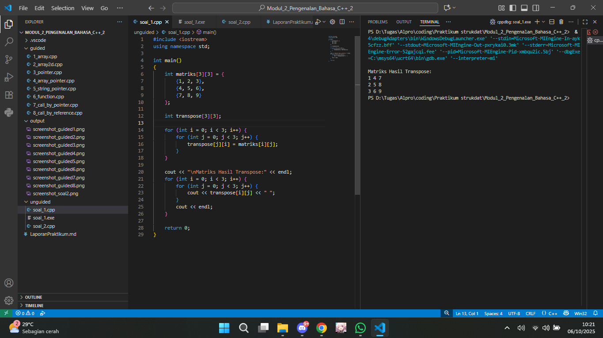

# <h1 align="center">Laporan Praktikum Modul 2 <br> Pengenalan Bahasa C++ 2</h1>
<p align="center">Rafi Maheswara - 103112400135</p>

## Dasar Teori

Array adalah struktur data yang menyimpan sekelompok elemen yang sama dalam satu nama, dengan semua elemen tersimpan secara berurutan di memori. Akses ke setiap elemen menjadi cepat karena menggunakan indeks yang dimulai dari angka nol. Nama array itu sendiri berfungsi sebagai pointer konstan yang menunjuk ke alamat memori elemen pertama.

Pointer adalah variabel khusus yang digunakan untuk menyimpan alamat memori dari variabel lain. Pointer dideklarasikan dengan menggunakan tanda bintang. Operasi utama yang bisa dilakukan pada pointer adalah operator alamat yang digunakan untuk mendapatkan lokasi memori, dan operator dereferensi yang digunakan untuk mengakses nilai di lokasi tersebut.

## Guided

### soal 1 Array

```C++
#include <iostream>
using namespace std;

int main() {
    int nilai[5] = {1,2,3,4,5};
    
    for (int i = 0; i < 5; ++i) {
        cout << "Element ke-"<< i << " = " << nilai[i] << endl;
    }

    return 0;
}
```
> 

Program ini mendeklarasikan array nilai yang berisi 5 angka (1, 2, 3, 4, 5), kemudian menggunakan perulangan for untuk mengiterasi setiap elemen array dari indeks 0 hingga 4.

### soal 2 Array 2D

```C++
#include <iostream>
using namespace std;

int main() {
    int matrix[3][3] = {
        {1,2,3},
        {4,5,6},
        {7,8,9}
    };
    
    for (int i = 0; i < 3; ++i){
        for (int j = 0; j < 3; ++j){
            cout << matrix[i][j] << " ";
        }
        cout << endl;
    }
    return 0;
}
```
> 

Program menggunakan perulangan bersarang untuk mengakses setiap elemen matrix. Loop luar (i) mengiterasi baris, sedangkan loop dalam (j) mengiterasi kolom. Setiap elemen dicetak dengan spasi sebagai pemisah, dan setelah satu baris selesai dicetak, program pindah ke baris baru dengan (endl)

### soal 3 Pointer

```C++

#include <iostream>
using namespace std;

int main() {
    int umur = 25;
    int *p_umur;
    
    p_umur = &umur;
    
    cout << "Nilai 'umur': " << umur << endl;
    cout << "Alamat memori 'umur': " << &umur << endl;
    cout << "Nilai 'p_umur' (alamat):" << p_umur << endl;
    cout << "Nilai yang diakses 'p_umur': " << *p_umur << endl;
    cout << "Alamat memori dari pointer 'p_umur' itu sendiri: " << &p_umur << endl;
    
    return 0;
}
```
> 

Program membuat variabel umur bernilai 25 dan pointer p_umur yang menunjuk ke alamat memori variabel tersebut. Kemudian program menampilkan nilai variabel, alamat memori variabel, alamat yang disimpan pointer, nilai yang diakses melalui pointer, dan alamat memori pointer itu sendiri untuk menunjukkan bagaimana pointer bekerja dalam mengakses dan menyimpan alamat memori.

### soal 4 Array Pointer

```C++

#include <iostream>
using namespace std;

int main(){
    int data[5] = {10,20,30,40,50};
    int *p_data = data;

    cout << "Mengakses elemen array cara normal: " << endl;

    for (int i = 0; i < 5; ++i){
        cout << "Nilai elemen ke-" << i << ": " << data[i] << endl;
    }

    cout << "Mengakses elemen array menggunakan pointer: " << endl;

    for (int i = 0; i < 5; ++i){
        cout << "Nilai elemen ke-" << i << ": " << *(p_data + i) << endl;
    }

    return 0;
}
```
> 

Program menjalankan dua bagian output yang isinya sama. Bagian pertama menampilkan "Nilai elemen ke-0: 10" hingga "Nilai elemen ke-4: 50" menggunakan akses array normal, kemudian bagian kedua menampilkan output yang identik menggunakan pointer arithmetic.

### soal 5 String Pointer

```C++
#include <iostream>
using namespace std;

int main() {
    char pesan_array[] = "Nasi Padang";
    char *pesan_pointer = "Ayam Bakar 23";

    cout << "String Array: " << pesan_array << endl;
    cout << "String Pointer: " << pesan_pointer << endl;

    // Mengubah karakter dalam array diperbolehkan
    pesan_array[0] = 'h';
    cout << "String Array setelah diubah: " << pesan_array << endl;

    // Pointer dapat diubah untuk menunjuk ke string lain
    pesan_pointer = "Sariman";
    cout << "String Pointer setelah menunjuk ke string lain: " << pesan_pointer << endl;

    return 0;
}
```
> 

Program ini mendeklarasiakan perbedaan array karakter dan pointer karakter dalam menyimpan string. Array (pesan_array) dapat dimodifikasi karakternya, sedangkan pointer (pesan_pointer) dapat diarahkan ke string lain. Program menampilkan string awal, kemudian menampilkan hasil setelah perubahan pada keduanya.

### soal 6 Function

```C++
#include <iostream>
using namespace std;

int tambah(int a, int b)
{
    return a + b;
}

void tampilkanHasil(int a, int b, int hasil) {
    cout << "Hasil penjumlahan " << a << " + " << b << " adalah: " << hasil << endl;
}

int main() {
    int angka1 = 10;
    int angka2 = 5;

    int hasilJumlah = tambah(angka1, angka2);

    tampilkanHasil(angka1, angka2, hasilJumlah);

    return 0;
}
```
> 

program mendeklarasikan dua variabel (10 dan 5), memanggil fungsi tambah untuk menjumlahkannya, kemudian memanggil tampilkanHasil untuk menampilkan hasilnya.

### soal 7 Call By Pointer

```C++
#include <iostream>
using namespace std;

void tukar(int *px, int *py)
{
    int temp = *px;
    *px = *py;
    *py = temp;
}

int main()
{
    int a = 10, b = 20;
    cout << "Sebelum ditukar: a = " << a << ", b = " << b << endl;
    tukar(&a, &b);
    cout << "Setelah ditukar: a = " << a << ", b = " << b << endl;
    return 0;
}
```
> 

Program ini mendemonstrasikan penggunaan pointer sebagai parameter fungsi untuk menukar nilai dua variabel. Fungsi tukar() menerima dua pointer sebagai parameter dan menukar nilai di alamat memori yang ditunjuk menggunakan variabel temporary. Di fungsi main(), variabel a bernilai 10 dan b bernilai 20, kemudian alamat keduanya dikirim ke fungsi tukar() menggunakan operator &

### soal 8 Call By Reference

```C++
#include <iostream>
using namespace std;

void tukar(int &x, int &y)
{
    int temp = x;
    x = y;
    y = temp;
}

int main()
{
    int a = 10, b = 20;
    cout << "Sebelum ditukar: a = " << a << ", b = " << b << endl;
    tukar(a, b);
    cout << "Setelah ditukar: a = " << a << ", b = " << b << endl;
    return 0;
}
```
> 

Program ini menukar nilai dua variabel menggunakan call by reference. Variabel a bernilai 10 dan b bernilai 20 dikirim ke fungsi tukar() yang menggunakan parameter reference (&).

## Unguided

### Soal 1

Buatlah sebuah program untuk melakukan transpose pada sebuah matriks persegi berukuran 3x3. Operasi transpose adalah mengubah baris menjadi kolom dan sebaliknya. Inisialisasi matriks awal di dalam kode, kemudian buat logika untuk melakukan transpose dan simpan hasilnya ke dalam matriks baru. Terakhir, tampilkan matriks awal dan matriks hasil transpose.

```C++
#include <iostream>
using namespace std;

int main()
{
    int matriks[3][3] = {
        {1, 2, 3},
        {4, 5, 6},
        {7, 8, 9}
    };
    
    int transpose[3][3];

    for (int i = 0; i < 3; i++) {
        for (int j = 0; j < 3; j++) {
            transpose[j][i] = matriks[i][j];
        }
    }
    
    cout << "\nMatriks Hasil Transpose:" << endl;
    for (int i = 0; i < 3; i++) {
        for (int j = 0; j < 3; j++) {
            cout << transpose[i][j] << " ";
        }
        cout << endl;
    }
    
    return 0;
}
```

> Output
> 

Program ini melakukan operasi transpose pada sebuah matriks berukuran 3x3. Prosesnya dilakukan menggunakan nested loop, dimana elemen pada posisi baris ke-i dan kolom ke-j dari matriks asli akan dipindahkan ke posisi baris ke-j dan kolom ke-i pada matriks hasil. Setelah proses transpose selesai, program akan menampilkan matriks hasil ke layar.

### Soal 2

Buatlah program yang menunjukkan penggunaan call by reference. Buat sebuah prosedur bernama kuadratkan yang menerima satu parameter integer secara referensi (&). Prosedur ini akan mengubah nilai asli variabel yang dilewatkan dengan nilai kuadratnya. Tampilkan nilai variabel di main() sebelum dan sesudah memanggil prosedur untuk membuktikan perubahannya.

```C++
#include <iostream>
using namespace std;

void kuadratkan(int &angka)
{
    angka = angka * angka;
}

int main(){

    int nilai;
    cout << "Masukkan Nilai = ";
    cin >> nilai;
    cout << "Nilai awal: " << nilai << endl;
    kuadratkan(nilai);
    cout << "Nilai setelah dikuadratkan: " << nilai << endl;
    return 0;
}
```

> Output
> 

Program meminta user memasukkan angka, lalu memanggil fungsi untuk mengkuadratkannya. Penggunaan simbol & pada parameter fungsi memungkinkan fungsi memodifikasi nilai variabel asli secara langsung, bukan salinannya. Setelah fungsi dieksekusi, program menampilkan nilai sebelum dan sesudah dikuadratkan.

## Referensi

1. Dinata, R. K., & Hasdyna, N. (2025). Algoritma dan Pemrograman: Konsep Dasar, Logika, dan Implementasi dengan C++ & Python. Serasi Media Teknologi. https://books.google.com/books?hl=id&lr=&id=6kBlEQAAQBAJ&oi=fnd&pg=PA1&dq=bahasa+pemrograman+c%2B%2B+array&ots=bk_HI3xSBN&sig=1Hpd0ZgsybwRJiWdhlV3mCEAe6w
2. Guntara, R. G. (2023). ALGORITMA DAN PEMROGRAMAN DASAR: Menggunakan Bahasa Pemrograman C++ dengan Contoh Kasus Aplikasi untuk Bisnis dan Manajemen. CV. Ruang Tentor. https://books.google.com/books?hl=id&lr=&id=NO_LEAAAQBAJ&oi=fnd&pg=PP1&dq=bahasa+pemrograman+c%2B%2B+array&ots=2Fy9t5bo-6&sig=IEpObWmOGnSM-_hcwcGMRc3y-2A
3. Anita Sindar, R. M. S. (2019). Struktur Data Dan Algoritma Dengan C++ (Vol. 1). CV. AA. RIZKY. https://books.google.com/books?hl=id&lr=&id=GP_ADwAAQBAJ&oi=fnd&pg=PA23&dq=bahasa+pemrograman+c%2B%2B+pointer&ots=86j8Vl4PeN&sig=Y8PH3MxqztsFCr6HnjJIKfS--ow