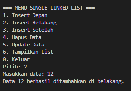
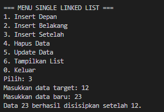
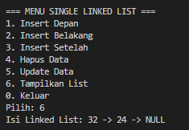
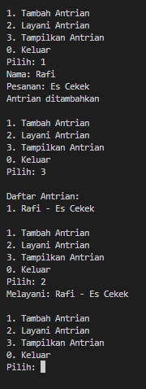

# <h1 align="center">Laporan Praktikum Modul 4 <br> Linklist</h1>
<p align="center">Rafi Maheswara - 103112400135</p>

## Dasar Teori

Linked List adalah struktur data linear yang elemen-elemennya (node) tersebar di memori dan dihubungkan oleh pointer atau referensi. Setiap node terdiri dari Data dan Pointer (Next) yang menunjuk ke node berikutnya. Node pertama disebut Head, dan node terakhir disebut Tail, yang pointer-nya menunjuk ke NULL. Keunggulan utamanya adalah alokasi memori yang dinamis dan efisiensi waktu O(1) untuk operasi penyisipan dan penghapusan (setelah lokasi diketahui), karena hanya melibatkan penataan ulang pointer. Namun, kerugian utamanya adalah akses elemen yang lambat (O(n)) karena penelusuran harus selalu dimulai dari Head. Jenis utama meliputi Singly (satu arah), Doubly (dua arah), dan Circular (melingkar).

## Guided

### soal 1 

```C++
#include <iostream>
using namespace std;

// Struktur Node
struct Node {
    int data;
    Node* next;
};

// Pointer awal dan akhir
Node* head = nullptr;

// Fungsi untuk membuat node baru
Node* createNode(int data) {
    Node* newNode = new Node();
    newNode->data = data;
    newNode->next = nullptr;
    return newNode;
}

void insertDepan(int data) {
    Node* newNode = createNode(data);
    newNode->next = head;
    head = newNode;
    cout << "Data" << data << "Berhasil ditambahkan di depan.\n" << endl;
}

void insertBelakang(int data) {
    Node* newNode = createNode(data);
    if (head == nullptr) {
        head = newNode;
    } else {
        Node* temp = head;
        while (temp->next != nullptr) {
            temp = temp->next;
        }
        temp->next = newNode;
    }
    cout << "Data " << data << " berhasil ditambahkan di belakang.\n";
}

void insertSetelah(int target, int dataBaru) {
    Node* temp = head;
    while (temp != nullptr && temp->data != target) {
        temp = temp->next;
    }

    if (temp == nullptr) {
        cout << "Data " << target << " tidak ditemukan!\n";
    } else {
        Node* newNode = createNode(dataBaru);
        newNode->next = temp->next;
        temp->next = newNode;
        cout << "Data " << dataBaru << " berhasil disisipkan setelah " << target << ".\n";
    }
}

// ========== DELETE FUNCTION ==========
void hapusNode(int data) {
    if (head == nullptr) {
        cout << "List kosong!\n";
        return;
    }

    Node* temp = head;
    Node* prev = nullptr;

    // Jika data di node pertama
    if (temp != nullptr && temp->data == data) {
        head = temp->next;
        delete temp;
        cout << "Data " << data << " berhasil dihapus.\n";
        return;
    }

    // Cari node yang akan dihapus
    while (temp != nullptr && temp->data != data) {
        prev = temp;
        temp = temp->next;
    }

    // Jika data tidak ditemukan
    if (temp == nullptr) {
        cout << "Data " << data << " tidak ditemukan!\n";
        return;
    }

    prev->next = temp->next;
    delete temp;
    cout << "Data " << data << " berhasil dihapus.\n";
}

// ========== UPDATE FUNCTION ==========
void updateNode(int dataLama, int dataBaru) {
    Node* temp = head;
    while (temp != nullptr && temp->data != dataLama) {
        temp = temp->next;
    }

    if (temp == nullptr) {
        cout << "Data " << dataLama << " tidak ditemukan!\n";
    } else {
        temp->data = dataBaru;
        cout << "Data " << dataLama << " berhasil diupdate menjadi " << dataBaru << ".\n";
    }
}

// ========== DISPLAY FUNCTION ==========
void tampilkanList() {
    if (head == nullptr) {
        cout << "List kosong!\n";
        return;
    }

    Node* temp = head;
    cout << "Isi Linked List: ";
    while (temp != nullptr) {
        cout << temp->data << " -> ";
        temp = temp->next;
     }
    cout << "NULL\n";
}

// ========== MAIN PROGRAM ==========
int main() {
    int pilihan, data, target, dataBaru;

    do {
        cout << "\n=== MENU SINGLE LINKED LIST ===\n";
        cout << "1. Insert Depan\n";
        cout << "2. Insert Belakang\n";
        cout << "3. Insert Setelah\n";
        cout << "4. Hapus Data\n";
        cout << "5. Update Data\n";
        cout << "6. Tampilkan List\n";
        cout << "0. Keluar\n";
        cout << "Pilih: ";
        cin >> pilihan;

        switch (pilihan) {
            case 1:
                cout << "Masukkan data: ";
                cin >> data;
                insertDepan(data);
                break;
            case 2:
                cout << "Masukkan data: ";
                cin >> data;
                insertBelakang(data);
                break;
            case 3:
                cout << "Masukkan data target: ";
                cin >> target;
                cout << "Masukkan data baru: ";
                cin >> dataBaru;
                insertSetelah(target, dataBaru);
                break;
            case 4:
                cout << "Masukkan data yang ingin dihapus: ";
                cin >> data;
                hapusNode(data);
                break;
            case 5:
                cout << "Masukkan data lama: ";
                cin >> data;
                cout << "Masukkan data baru: ";
                cin >> dataBaru;
                updateNode(data, dataBaru);
                break;
            case 6:
                tampilkanList();
                break;
            case 0:
                cout << "Program selesai.\n";
                break;
            default:
                cout << "Pilihan tidak valid!\n";
        }
    } while (pilihan != 0);

    return 0;
}

```
> 
> 
> 
> 
> 
> 

Program Single Linked List ini membuat struktur data berupa rantai node yang berisi data integer, dimulai dari pointer `head` sebagai penanda awal list, kemudian menampilkan menu interaktif dengan 6 pilihan operasi yaitu insert depan (menambah node di awal), insert belakang (menambah node di akhir), insert setelah (menyisipkan node setelah nilai tertentu), hapus data (menghapus node berdasarkan nilai), update data (mengubah nilai node lama menjadi baru), dan tampilkan list (menampilkan semua isi dalam format `nilai -> nilai -> NULL`). Setiap operasi memberikan feedback berhasil atau gagal kepada user, dan menu akan terus berulang hingga user memilih opsi 0 untuk keluar, sehingga program ini merupakan implementasi lengkap struktur data linked list dengan operasi CRUD (Create, Read, Update, Delete) yang sederhana dan interaktif.

## Unguided

### Soal 1

buatlah single linked list untuk Antrian yang menyimpan data pembeli( nama dan pesanan). program memiliki beberapa menu seperti tambah antrian,  layani antrian(hapus), dan tampilkan antrian. \*antrian pertama harus yang pertama dilayani

```C++
#include <iostream>
using namespace std;

struct Node {
    string nama;
    string pesanan;
    Node* next;
};

Node* depan = nullptr;
Node* belakang = nullptr;

void tambahAntrian() {
    Node* baru = new Node();
    cout << "Nama: ";
    cin.ignore();
    getline(cin, baru->nama);
    cout << "Pesanan: ";
    getline(cin, baru->pesanan);
    baru->next = nullptr;
    
    if (belakang == nullptr) {
        depan = belakang = baru;
    } else {
        belakang->next = baru;
        belakang = baru;
    }
    cout << "Antrian ditambahkan\n";
}

void layaniAntrian() {
    if (depan == nullptr) {
        cout << "Antrian kosong\n";
        return;
    }
    
    Node* temp = depan;
    cout << "Melayani: " << temp->nama << " - " << temp->pesanan << endl;
    depan = depan->next;
    
    if (depan == nullptr) {
        belakang = nullptr;
    }
    
    delete temp;
}

void tampilkanAntrian() {
    if (depan == nullptr) {
        cout << "Antrian kosong\n";
        return;
    }
    
    Node* temp = depan;
    int no = 1;
    cout << "\nDaftar Antrian:\n";
    while (temp != nullptr) {
        cout << no << ". " << temp->nama << " - " << temp->pesanan << endl;
        temp = temp->next;
        no++;
    }
}

int main() {
    int pilih;
    
    do {
        cout << "\n1. Tambah Antrian\n";
        cout << "2. Layani Antrian\n";
        cout << "3. Tampilkan Antrian\n";
        cout << "0. Keluar\n";
        cout << "Pilih: ";
        cin >> pilih;
        
        if (pilih == 1) {
            tambahAntrian();
        } else if (pilih == 2) {
            layaniAntrian();
        } else if (pilih == 3) {
            tampilkanAntrian();
        }
        
    } while (pilih != 0);
    
    return 0;
}
```

> Output
> 

Program menampilkan menu dengan pilihan tambah antrian, layani antrian, tampilkan antrian, dan keluar. Saat menambah antrian, pengguna input nama dan pesanan lalu muncul pesan "Antrian ditambahkan". Opsi tampilkan antrian menunjukkan daftar nomor urut, nama, dan pesanan. Opsi layani antrian memproses dan menghapus antrian pertama dengan menampilkan "Melayani:" diikuti nama dan pesanan. Jika antrian kosong, muncul pesan "Antrian kosong". Program berjalan terus hingga pengguna memilih keluar.

### Soal 2

buatlah program kode untuk membalik (reverse) singly linked list (1-2-3 menjadi 3-2-1) 

```C++
#include <iostream>
using namespace std;

struct Node {
    int data;
    Node* next;
};

void tampilkan(Node* head) {
    while (head != nullptr) {
        cout << head->data;
        if (head->next != nullptr) cout << " -> ";
        head = head->next;
    }
    cout << endl;
}

Node* reverse(Node* head) {
    Node* prev = nullptr;
    Node* current = head;
    Node* next = nullptr;
    
    while (current != nullptr) {
        next = current->next;
        current->next = prev;
        prev = current;
        current = next;
    }
    return prev;
}

int main() {
    Node* head = new Node{1, nullptr};
    head->next = new Node{2, nullptr};
    head->next->next = new Node{3, nullptr};
    
    cout << "Sebelum: ";
    tampilkan(head);
    
    head = reverse(head);
    
    cout << "Sesudah: ";
    tampilkan(head);
    
    return 0;
}
```

> Output
> 

Proses reverse menggunakan 3 pointer: prev, current, dan next. Loop berjalan untuk setiap node dengan langkah: simpan node berikutnya di next, ubah arah pointer current ke prev, lalu geser prev dan current ke depan. Setelah loop selesai, prev menjadi head baru. Hasilnya semua panah pointer terbalik dari 1->2->3 menjadi 3->2->1.
## Referensi

1. Dinata, R. K., & Hasdyna, N. (2025). Algoritma dan Pemrograman: Konsep Dasar, Logika, dan Implementasi dengan C++ & Python. Serasi Media Teknologi. https://books.google.com/books?hl=id&lr=&id=6kBlEQAAQBAJ&oi=fnd&pg=PA1&dq=bahasa+pemrograman+c%2B%2B+array&ots=bk_HI3xSBN&sig=1Hpd0ZgsybwRJiWdhlV3mCEAe6w
2. Guntara, R. G. (2023). ALGORITMA DAN PEMROGRAMAN DASAR: Menggunakan Bahasa Pemrograman C++ dengan Contoh Kasus Aplikasi untuk Bisnis dan Manajemen. CV. Ruang Tentor. https://books.google.com/books?hl=id&lr=&id=NO_LEAAAQBAJ&oi=fnd&pg=PP1&dq=bahasa+pemrograman+c%2B%2B+array&ots=2Fy9t5bo-6&sig=IEpObWmOGnSM-_hcwcGMRc3y-2A
3. Anita Sindar, R. M. S. (2019). Struktur Data Dan Algoritma Dengan C++ (Vol. 1). CV. AA. RIZKY. https://books.google.com/books?hl=id&lr=&id=GP_ADwAAQBAJ&oi=fnd&pg=PA23&dq=bahasa+pemrograman+c%2B%2B+pointer&ots=86j8Vl4PeN&sig=Y8PH3MxqztsFCr6HnjJIKfS--ow