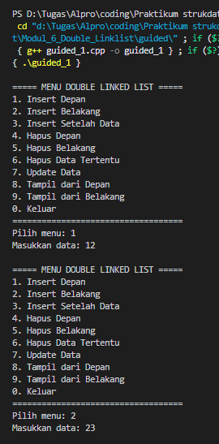
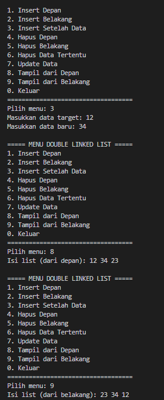
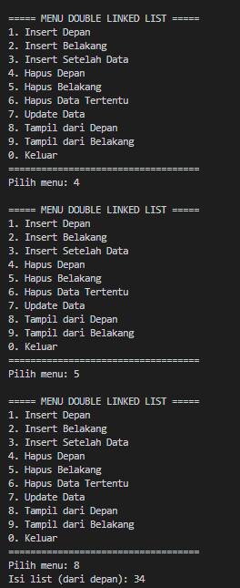
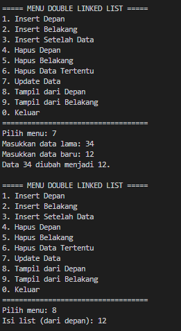
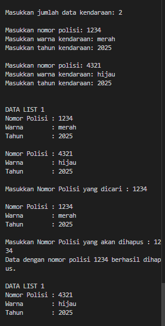

# <h1 align="center">Laporan Praktikum Modul 5 <br> Double Linklist</h1>
<p align="center">Rafi Maheswara - 103112400135</p>

## Dasar Teori

Double Linked List, atau Daftar Berantai Ganda, adalah jenis struktur data linier di mana setiap elemen, yang disebut node, memiliki kemampuan untuk merujuk ke node sebelumnya dan juga node berikutnya dalam urutan. Secara spesifik, setiap node menyimpan data dan dua pointer (atau referensi): satu pointer (prev) menunjuk ke node tepat di belakangnya (mundur), dan pointer lainnya (next) menunjuk ke node tepat di depannya (maju). Ini berbeda dari Single Linked List yang hanya memiliki pointer ke node berikutnya. Fitur ini memberikan keuntungan signifikan, terutama dalam memungkinkan traversal dua arah (maju dan mundur) dan membuat operasi penghapusan node menjadi lebih efisien karena kita memiliki akses langsung ke node sebelum dan sesudahnya. Namun, konsekuensinya adalah Double Linked List membutuhkan memori ekstra karena adanya pointer kedua (prev) di setiap node.

## Guided

### soal 1 

```C++ 
#include <iostream>
using namespace std;

struct Node {

    int data;
    Node* next;
    Node* prev;

};

Node* head = nullptr;
Node* tail = nullptr;

void insertdepan(int data){
    Node* newNode = new Node();
    newNode->data = data;
    newNode->next = head;
    newNode->prev = nullptr;

    if (head != nullptr) {
        head->prev = newNode;
    } else {
        tail = newNode; 
    }
    head = newNode;

}


void insertbelakang(int data){
    Node* newNode = new Node();
    newNode->data = data;
    newNode->next = nullptr;
    newNode->prev = tail;

    if (tail != nullptr) {
        tail->next = newNode;
    } else {
        head = newNode; 
    }
    tail = newNode;

}

void insertsetelah (int target, int data) {
    Node* current = head;
    while (current != nullptr && current->data != target) {
        current = current->next;
    }

    if (current != nullptr) {
        Node* newNode = new Node();
        newNode->data = data;
        newNode->next = current->next;
        newNode->prev = current;

        if (current->next != nullptr) {
            current->next->prev = newNode;
        } else {
            tail = newNode; 
        }
        current->next = newNode; 
    }
}
void hapusdepan() {
    if (head == nullptr){
        cout << "list kosong" << endl;
        return;
    } 

    Node* temp = head;
    head = head->next;

    if (head != nullptr) {
        head->prev = nullptr;
    } else {
        tail = nullptr; 
    }
    delete temp;
}

void hapusbelakang() {
    if (tail == nullptr){
        cout << "list kosong" << endl;
        return;
    } 

    Node* temp = tail;
    tail = tail->prev;

    if (tail != nullptr) {
        tail->next = nullptr;
    } else {
        head = nullptr; 
    }
    delete temp;
}

void hapusdata(int target) {
    Node* current = head;
    while (current != nullptr && current->data != target) {
        current = current->next;
    }

    if (current == nullptr) {
        cout << "Data " << target << " tidak ditemukan." << endl;
        return;
    }

    if (current == head) {
        hapusdepan();
    } else if (current == tail) {
        hapusbelakang();
    }

    else {
        current->prev->next = current->next;
        current->next->prev = current->prev;
        cout << "Data " << target << " telah dihapus." << endl; 
        delete current;
    }

}

void updatedata(int oldData, int newData) {
    Node* current = head;
    while (current != nullptr && current->data != oldData)
        current = current->next;

    if (current == nullptr) {
        cout << "Data " << oldData << " tidak ditemukan.\n";
        return;
    }

    current->data = newData;
    cout << "Data " << oldData << " diubah menjadi " << newData << ".\n";
}

void tampildepan() {
    if (head == nullptr) {
        cout << "List kosong.\n";
        return;
    }

    cout << "Isi list (dari depan): ";
    Node* current = head;
    while (current != nullptr) {
        cout << current->data << " ";
        current = current->next;
    }
    cout << "\n";
}


void tampilbelakang() {
    if (tail == nullptr) {
        cout << "List kosong.\n";
        return;
    }

    cout << "Isi list (dari belakang): ";
    Node* current = tail;
    while (current != nullptr) {
        cout << current->data << " ";
        current = current->prev;
    }
    cout << "\n";
}


int main() {
    int pilihan, data, target, oldData, newData;

    do {
        cout << "\n===== MENU DOUBLE LINKED LIST =====\n";
        cout << "1. Insert Depan\n";
        cout << "2. Insert Belakang\n";
        cout << "3. Insert Setelah Data\n";
        cout << "4. Hapus Depan\n";
        cout << "5. Hapus Belakang\n";
        cout << "6. Hapus Data Tertentu\n";
        cout << "7. Update Data\n";
        cout << "8. Tampil dari Depan\n";
        cout << "9. Tampil dari Belakang\n";
        cout << "0. Keluar\n";
        cout << "===================================\n";
        cout << "Pilih menu: ";
        cin >> pilihan;

        switch (pilihan) {
            case 1:
                cout << "Masukkan data: ";
                cin >> data;
                insertdepan(data);
                break;
            case 2:
                cout << "Masukkan data: ";
                cin >> data;
                insertbelakang(data);
                break;
            case 3:
                cout << "Masukkan data target: ";
                cin >> target;
                cout << "Masukkan data baru: ";
                cin >> data;
                insertsetelah(target, data);
                break;
            case 4:
                hapusdepan();
                break;
            case 5:
                hapusbelakang();
                break;
            case 6:
                cout << "Masukkan data yang ingin dihapus: ";
                cin >> target;
                hapusdata(target);
                break;
            case 7:
                cout << "Masukkan data lama: ";
                cin >> oldData;
                cout << "Masukkan data baru: ";
                cin >> newData;
                updatedata(oldData, newData);
                break;
            case 8:
                tampildepan();
                break;
            case 9:
                tampilbelakang();
                break;
            case 0:
                cout << "👋 Keluar dari program.\n";
                break;
            default:
                cout << "Pilihan tidak valid.\n";
        }

    } while (pilihan != 0);

    return 0;
}

```
> 
> 
> 
> 

Program menggunakan dua pointer global yaitu head untuk menandai node pertama dan tail untuk menandai node terakhir dalam list. Terdapat tiga fungsi insert yang tersedia: insertdepan untuk menambah data di awal list, insertbelakang untuk menambah di akhir list, dan insertsetelah yang memungkinkan penyisipan data setelah node dengan nilai tertentu. Untuk operasi penghapusan, program menyediakan hapusdepan yang menghapus node pertama, hapusbelakang yang menghapus node terakhir, dan hapusdata yang dapat menghapus node dengan nilai spesifik di posisi manapun dalam list.

## Unguided

### Soal 1

#### doublylist.cpp
```C++
#include "Doublylist.h"

void buatListKosong(List &daftarKendaraan) {
    daftarKendaraan.first = nullptr;
    daftarKendaraan.last = nullptr;
}

Address buatNodeBaru(InfoKendaraan kendaraanBaru) {
    Address node = new Node;
    node->data = kendaraanBaru;
    node->next = nullptr;
    node->prev = nullptr;
    return node;
}

void hapusNode(Address node) {
    delete node;
}

void tambahKendaraanDiAkhir(List &daftarKendaraan, Address nodeBaru) {
    if (daftarKendaraan.first == nullptr) {
        daftarKendaraan.first = nodeBaru;
        daftarKendaraan.last = nodeBaru;
    } else {
        daftarKendaraan.last->next = nodeBaru;
        nodeBaru->prev = daftarKendaraan.last;
        daftarKendaraan.last = nodeBaru;
    }
}

void tampilkanKendaraan(List daftarKendaraan) {
    Address node = daftarKendaraan.first;
    cout << "\nDATA LIST 1\n";
    while (node != nullptr) {
        cout << "Nomor Polisi : " << node->data.nomorPolisi << endl;
        cout << "Warna        : " << node->data.warna << endl;
        cout << "Tahun        : " << node->data.tahun << endl << endl;
        node = node->next;
    }
}

Address cariKendaraan(List daftarKendaraan, string nomorPolisi) {
    Address node = daftarKendaraan.first;
    while (node != nullptr) {
        if (node->data.nomorPolisi == nomorPolisi) {
            return node;
        }
        node = node->next;
    }
    return nullptr;
}

void hapusKendaraanPertama(List &daftarKendaraan, Address &node) {
    if (daftarKendaraan.first != nullptr) {
        node = daftarKendaraan.first;
        if (daftarKendaraan.first == daftarKendaraan.last) {
            daftarKendaraan.first = nullptr;
            daftarKendaraan.last = nullptr;
        } else {
            daftarKendaraan.first = daftarKendaraan.first->next;
            daftarKendaraan.first->prev = nullptr;
            node->next = nullptr;
        }
    }
}

void hapusKendaraanTerakhir(List &daftarKendaraan, Address &node) {
    if (daftarKendaraan.last != nullptr) {
        node = daftarKendaraan.last;
        if (daftarKendaraan.first == daftarKendaraan.last) {
            daftarKendaraan.first = nullptr;
            daftarKendaraan.last = nullptr;
        } else {
            daftarKendaraan.last = daftarKendaraan.last->prev;
            daftarKendaraan.last->next = nullptr;
            node->prev = nullptr;
        }
    }
}

void hapusKendaraanSetelah(Address sebelum, Address &node) {
    if (sebelum != nullptr && sebelum->next != nullptr) {
        node = sebelum->next;
        sebelum->next = node->next;
        if (node->next != nullptr) {
            node->next->prev = sebelum;
        }
        node->next = nullptr;
        node->prev = nullptr;
    }
}
```
#### doublylist.h
```C++
#ifndef DOUBLYLIST_H
#define DOUBLYLIST_H

#include <iostream>
#include <string>
using namespace std;

struct Kendaraan {
    string nomorPolisi;
    string warna;
    int tahun;
};

typedef Kendaraan InfoKendaraan;

struct Node {
    InfoKendaraan data;
    Node* next;
    Node* prev;
};

typedef Node* Address;

struct List {
    Address first;
    Address last;
};

void buatListKosong(List &daftarKendaraan);
Address buatNodeBaru(InfoKendaraan kendaraanBaru);
void hapusNode(Address node);
void tambahKendaraanDiAkhir(List &daftarKendaraan, Address nodeBaru);
void tampilkanKendaraan(List daftarKendaraan);
Address cariKendaraan(List daftarKendaraan, string nomorPolisi);
void hapusKendaraanPertama(List &daftarKendaraan, Address &node);
void hapusKendaraanTerakhir(List &daftarKendaraan, Address &node);
void hapusKendaraanSetelah(Address sebelum, Address &node);

#endif
```
#### main.cpp
```C++
#include "Doublylist.h"

bool cekDuplikat(List daftarKendaraan, string nomorPolisi) {
    Address node = daftarKendaraan.first;
    while (node != nullptr) {
        if (node->data.nomorPolisi == nomorPolisi) {
            return true;
        }
        node = node->next;
    }
    return false;
}

int main() {
    List daftarKendaraan;
    buatListKosong(daftarKendaraan);

    int jumlah;
    cout << "Masukkan jumlah data kendaraan: ";
    cin >> jumlah;
    cout << endl;

    for (int i = 0; i < jumlah; i++) {
        InfoKendaraan kendaraanBaru;

        cout << "Masukkan nomor polisi: ";
        cin >> kendaraanBaru.nomorPolisi;

        if (cekDuplikat(daftarKendaraan, kendaraanBaru.nomorPolisi)) {
            cout << "Nomor polisi sudah terdaftar\n\n";
            i--;
            continue;
        }

        cout << "Masukkan warna kendaraan: ";
        cin >> kendaraanBaru.warna;
        cout << "Masukkan tahun kendaraan: ";
        cin >> kendaraanBaru.tahun;
        cout << endl;

        Address nodeBaru = buatNodeBaru(kendaraanBaru);
        tambahKendaraanDiAkhir(daftarKendaraan, nodeBaru);
    }

    tampilkanKendaraan(daftarKendaraan);

    string nomorDicari;
    cout << "Masukkan Nomor Polisi yang dicari : ";
    cin >> nomorDicari;

    Address ditemukan = cariKendaraan(daftarKendaraan, nomorDicari);
    if (ditemukan != nullptr) {
        cout << "\nNomor Polisi : " << ditemukan->data.nomorPolisi << endl;
        cout << "Warna        : " << ditemukan->data.warna << endl;
        cout << "Tahun        : " << ditemukan->data.tahun << endl;
    } else {
        cout << "Data tidak ditemukan.\n";
    }

    string nomorDihapus;
    cout << "\nMasukkan Nomor Polisi yang akan dihapus : ";
    cin >> nomorDihapus;

    Address nodeDihapus = cariKendaraan(daftarKendaraan, nomorDihapus);
    if (nodeDihapus != nullptr) {
        if (nodeDihapus == daftarKendaraan.first) {
            hapusKendaraanPertama(daftarKendaraan, nodeDihapus);
        } else if (nodeDihapus == daftarKendaraan.last) {
            hapusKendaraanTerakhir(daftarKendaraan, nodeDihapus);
        } else {
            hapusKendaraanSetelah(nodeDihapus->prev, nodeDihapus);
        }
        hapusNode(nodeDihapus);
        cout << "Data dengan nomor polisi " << nomorDihapus << " berhasil dihapus.\n";
    } else {
        cout << "Data tidak ditemukan.\n";
    }

    tampilkanKendaraan(daftarKendaraan);
    return 0;
}
```

> Output
> 

Program ini adalah aplikasi manajemen data kendaraan yang menggunakan struktur data doubly linked list dengan implementasi yang terpisah dalam file header "Doublylist.h". Program ini dirancang untuk mengelola informasi kendaraan yang mencakup nomor polisi, warna, dan tahun pembuatan dengan fitur validasi untuk mencegah duplikasi data. 
## Referensi

1. Dinata, R. K., & Hasdyna, N. (2025). Algoritma dan Pemrograman: Konsep Dasar, Logika, dan Implementasi dengan C++ & Python. Serasi Media Teknologi. https://books.google.com/books?hl=id&lr=&id=6kBlEQAAQBAJ&oi=fnd&pg=PA1&dq=bahasa+pemrograman+c%2B%2B+array&ots=bk_HI3xSBN&sig=1Hpd0ZgsybwRJiWdhlV3mCEAe6w
2. Guntara, R. G. (2023). ALGORITMA DAN PEMROGRAMAN DASAR: Menggunakan Bahasa Pemrograman C++ dengan Contoh Kasus Aplikasi untuk Bisnis dan Manajemen. CV. Ruang Tentor. https://books.google.com/books?hl=id&lr=&id=NO_LEAAAQBAJ&oi=fnd&pg=PP1&dq=bahasa+pemrograman+c%2B%2B+array&ots=2Fy9t5bo-6&sig=IEpObWmOGnSM-_hcwcGMRc3y-2A
3. Anita Sindar, R. M. S. (2019). Struktur Data Dan Algoritma Dengan C++ (Vol. 1). CV. AA. RIZKY. https://books.google.com/books?hl=id&lr=&id=GP_ADwAAQBAJ&oi=fnd&pg=PA23&dq=bahasa+pemrograman+c%2B%2B+pointer&ots=86j8Vl4PeN&sig=Y8PH3MxqztsFCr6HnjJIKfS--ow