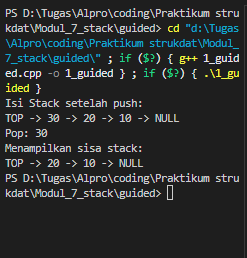
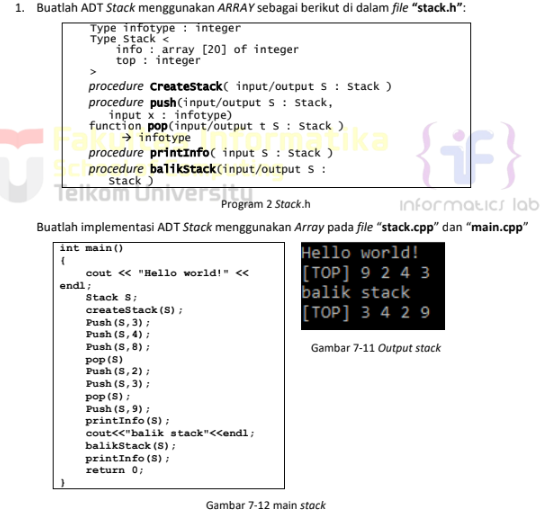
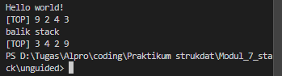
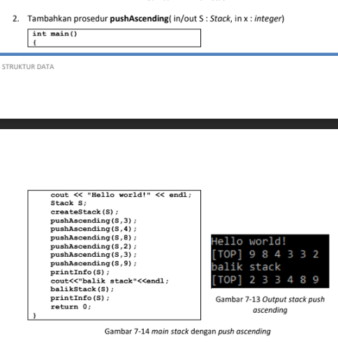
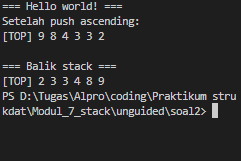
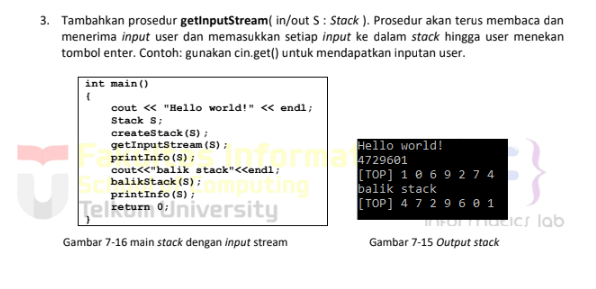
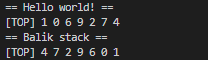

# <h1 align="center">Laporan Praktikum Modul 7 <br> Stack</h1>
<p align="center">Rafi Maheswara - 103112400135</p>

## Dasar Teori

Stack adalah struktur data linear yang beroperasi dengan prinsip LIFO (Last In, First Out), di mana elemen yang terakhir ditambahkan akan menjadi yang pertama diambil. Operasi utamanya meliputi push untuk menumpuk data di posisi teratas dan pop untuk mengambil data dari posisi tersebut. Dalam pemrograman C++, Stack dapat diimplementasikan secara manual menggunakan array atau linked list untuk memahami logikanya.

## Guided

### soal 1 

```C++
#include <iostream>
using namespace std;

struct Node {
    int data;
    Node* next;
};

bool isEmpty(Node *top) {
    return top == nullptr;
}

void push(Node *&top, int data) {
    Node* newNode = new Node();
    newNode->data = data;
    newNode->next = top;
    top = newNode;
}

int pop(Node *&top)
{
    if (isEmpty(top)){
        cout << "Stack Kosong, Tidak Bisa Pop" << endl;
        return 0;
    }

    int poppedData = top->data;
    Node *temp = top;
    top = top->next;

    delete temp;
    return poppedData;
}

void show(Node *top) { 
    if (isEmpty(top)) {
        cout << "Stack kosong.\n";
        return;
    }

    cout << "TOP -> ";
    Node *temp = top;

    while (temp != nullptr) {
        cout << temp->data << " -> ";
        temp = temp->next;
    }
    cout << "NULL" << endl;
}

int main(){
    Node *stack = nullptr;

    push(stack, 10);
    push(stack, 20);
    push(stack, 30);

    cout << "Isi Stack setelah push:\n";
    show(stack);

    cout << "Pop: " << pop(stack) << endl;

    cout << "Menampilkan sisa stack: \n";
    show(stack);

    return 0;

}

```
> 

Program ini mengimplementasikan struktur data Stack menggunakan Linked List dengan prinsip LIFO (Last In First Out). Pertama, program melakukan push tiga data yaitu 10, 20, dan 30 ke dalam stack, sehingga susunan stack menjadi TOP → 30 → 20 → 10 → NULL.

## Unguided

### Soal 1

> 

#### stack.h
```C++
#ifndef STACK_H
#define STACK_H

#include <iostream>
using namespace std;

typedef int infotype;


struct Stack {
    infotype info[20]; 
    int top;            
};
void createStack(Stack &S);
void push(Stack &S, infotype x);

infotype pop(Stack &S);

void printInfo(Stack S);
void balikStack(Stack &S);
bool isEmpty(Stack S);
bool isFull(Stack S);

#endif
```

#### stack.cpp
```C++
#include "stack.h"

void createStack(Stack &S) {
    S.top = -1;
}

bool isEmpty(Stack S) {
    return S.top == -1;
}

bool isFull(Stack S) {
    return S.top == 19;
}

void push(Stack &S, infotype x) {
    if (isFull(S)) {
        cout << "Stack penuh!" << endl;
    } else {
        S.top++;
        S.info[S.top] = x;
    }
}

infotype pop(Stack &S) {
    infotype x = 0;
    if (isEmpty(S)) {
        cout << "Stack kosong!" << endl;
    } else {
        x = S.info[S.top];
        S.top--;
    }
    return x;
}

void printInfo(Stack S) {
    if (isEmpty(S)) {
        cout << "Stack kosong!" << endl;
    } else {
        cout << "[TOP] ";
        for (int i = S.top; i >= 0; i--) {
            cout << S.info[i] << " ";
        }
        cout << endl;
    }
}

void balikStack(Stack &S) {
    Stack temp;
    createStack(temp);
    
    while (!isEmpty(S)) {
        push(temp, pop(S));
    }
    
    S = temp;
}
```

#### main.cpp
```C++
#include "stack.h"

int main()
{
    cout << "Hello world!" << endl;
    Stack S;
    createStack(S);
    push(S,3);
    push(S,4);
    push(S,8);
    pop(S);
    push(S,2);
    push(S,3);
    pop(S);
    push(S,9);
    printInfo(S);
    cout<<"balik stack"<<endl;
    balikStack(S);
    printInfo(S);
    return 0;
}
```

> Output
> 

Program menampilkan "Hello world!" lalu meminta user memasukkan angka. Ketika user mengetik 9243, setiap digit di-push ke stack secara berurutan. Karena stack bersifat LIFO (Last In First Out), digit terakhir (3) berada di TOP, sehingga ditampilkan "[TOP] 3 4 2 9". Kemudian program menjalankan balikStack() yang membalik urutan semua elemen. Stack yang awalnya 9,2,4,3 menjadi 3,4,2,9. Setelah dibalik, TOP berubah menjadi 9, sehingga output akhir menampilkan "[TOP] 9 2 4 3".

### Soal 2

> 

#### stack.h
```C++
#ifndef STACK_H
#define STACK_H

const int MAX_SIZE = 20;

typedef int infotype;

struct Stack {
    infotype info[MAX_SIZE];
    int top;
};

void createStack(Stack &S);
bool isFull(Stack S);
bool isEmpty(Stack S);
void push(Stack &S, infotype x);
infotype pop(Stack &S);
void printInfo(Stack S);
void balikStack(Stack &S);
void pushAscending(Stack &S, infotype x);

#endif
```

#### stack.cpp
```C++
#include "stack.h"
#include <iostream>
using namespace std;


void createStack(Stack &S) {
    S.top = -1;
}

bool isFull(Stack S) {
    return S.top == MAX_SIZE - 1;
}

bool isEmpty(Stack S) {
    return S.top == -1;
}
void push(Stack &S, infotype x) {
    if (!isFull(S)) {
        S.top++;
        S.info[S.top] = x;
    } else {
        cout << "Stack penuh!" << endl;
    }
}

infotype pop(Stack &S) {
    infotype x = -1;
    if (!isEmpty(S)) {
        x = S.info[S.top];
        S.top--;
    }
    return x;
}

void printInfo(Stack S) {
    cout << "[TOP] ";
    for (int i = S.top; i >= 0; i--) {
        cout << S.info[i] << " ";
    }
    cout << endl;
}

void balikStack(Stack &S) {
    Stack temp;
    createStack(temp);
    
    while (!isEmpty(S)) {
        push(temp, pop(S));
    }
    
    S = temp;
}

void pushAscending(Stack &S, infotype x) {
    if (isFull(S)) {
        cout << "Stack penuh!" << endl;
        return;
    }
    
    if (isEmpty(S) || x >= S.info[S.top]) {
        push(S, x);
    } else {
        Stack temp;
        createStack(temp);
        
        while (!isEmpty(S) && S.info[S.top] > x) {
            push(temp, pop(S));
        }

        push(S, x);
    
        while (!isEmpty(temp)) {
            push(S, pop(temp));
        }
    }
}
```

#### main.cpp
```C++
#include "stack.h"
#include <iostream>
using namespace std;

int main() {
    Stack S;
    
    cout << "=== Hello world! ===" << endl;
    createStack(S);
    
    pushAscending(S, 3);
    pushAscending(S, 4);
    pushAscending(S, 8);
    pushAscending(S, 2);
    pushAscending(S, 3);
    pushAscending(S, 9);
    
    cout << "Setelah push ascending:" << endl;
    printInfo(S);
    
    cout << "\n=== Balik stack ===" << endl;
    balikStack(S);
    printInfo(S);
    
    return 0;
}
```

> Output
> 

Program menampilkan "Hello world!" lalu meminta user memasukkan angka. Ketika user mengetik 998433 (atau angka serupa), setiap digit di-push ke stack secara berurutan. Karena stack bersifat LIFO (Last In First Out), digit terakhir yang dimasukkan berada di TOP, sehingga ditampilkan "[TOP] 9 8 4 3 3 2" dengan angka 2 di posisi TOP (terakhir dimasukkan). Kemudian program menjalankan balikStack() yang membalik urutan semua elemen dalam stack. Setelah dibalik, elemen yang tadinya di bottom (angka 9) berpindah ke TOP, sehingga output akhir menampilkan "[TOP] 2 3 3 4 8 9" dengan urutan terbalik dari sebelumnya.

### Soal 3

> 

#### stack.h
```C++
#ifndef STACK_H
#define STACK_H

const int MAX_SIZE = 20;

typedef int infotype;

struct Stack {
    infotype info[MAX_SIZE];
    int top;
};

void createStack(Stack &S);
bool isFull(Stack S);
bool isEmpty(Stack S);
void push(Stack &S, infotype x);
infotype pop(Stack &S);
void printInfo(Stack S);
void balikStack(Stack &S);
void pushAscending(Stack &S, infotype x);

#endif
```

#### stack.cpp
```C++
#include "stack.h"
#include <iostream>
using namespace std;

void createStack(Stack &S) {
    S.top = -1;
}

bool isFull(Stack S) {
    return S.top == MAX_SIZE - 1;
}

bool isEmpty(Stack S) {
    return S.top == -1;
}

void push(Stack &S, infotype x) {
    if (!isFull(S)) {
        S.top++;
        S.info[S.top] = x;
    } else {
        cout << "Stack penuh!" << endl;
    }
}

infotype pop(Stack &S) {
    infotype x = -1;
    if (!isEmpty(S)) {
        x = S.info[S.top];
        S.top--;
    }
    return x;
}

void printInfo(Stack S) {
    cout << "[TOP] ";
    for (int i = S.top; i >= 0; i--) {
        cout << S.info[i] << " ";
    }
    cout << endl;
}

void balikStack(Stack &S) {
    Stack temp;
    createStack(temp);
    
    while (!isEmpty(S)) {
        push(temp, pop(S));
    }
    
    S = temp;
}

void pushAscending(Stack &S, infotype x) {
    if (isFull(S)) {
        cout << "Stack penuh!" << endl;
        return;
    }
    
    if (isEmpty(S) || x >= S.info[S.top]) {
        push(S, x);
    } else {
        Stack temp;
        createStack(temp);
        
        while (!isEmpty(S) && S.info[S.top] > x) {
            push(temp, pop(S));
        }
        
        push(S, x);
        while (!isEmpty(temp)) {
            push(S, pop(temp));
        }
    }
}
```

#### main.cpp
```C++
#include "stack.h"
#include <iostream>
using namespace std;

int main() {
    Stack S;
    
    cout << "=== Hello world! ===" << endl;
    createStack(S);
    
    pushAscending(S, 3);
    pushAscending(S, 4);
    pushAscending(S, 8);
    pushAscending(S, 2);
    pushAscending(S, 3);
    pushAscending(S, 9);
    
    cout << "Setelah push ascending:" << endl;
    printInfo(S);
    
    cout << "\n=== Balik stack ===" << endl;
    balikStack(S);
    printInfo(S);
    
    return 0;
}
```

> Output
> 

Program menampilkan "Hello world!" dan nomor identifikasi 1729601. Kemudian user memasukkan angka 1069274, setiap digit di-push ke stack secara berurutan. Karena stack bersifat LIFO (Last In First Out), digit terakhir (4) berada di TOP, sehingga ditampilkan "[TOP] 1 0 6 9 2 7 4" dengan angka 4 di posisi TOP. Kemudian perintah "Balik stack", program menjalankan balikStack() yang membalik urutan semua elemen. Stack yang awalnya memiliki angka 1 di bottom dan 4 di top, setelah dibalik menjadi 4 di bottom dan 1 di top, sehingga output akhir menampilkan "[TOP] 4 7 2 9 6 0 1" dengan urutan terbalik dari sebelumnya.
## Referensi

1. Utami, E., Kom, M., Dhuhita, W. M. P., Kom, S., & Kom, M. (2017). Langkah Mudah Belajar Struktur Data Menggunakan C/C++. Elex Media Komputindo. https://books.google.com/books?hl=en&lr=&id=rURGDwAAQBAJ&oi=fnd&pg=PP1&dq=stack+pada+c%2B%2B&ots=4Vkqu4pucp&sig=UPph9-Z5Wo0_vRTR_wI91aAslEA
2. Anita Sindar, R. M. S. (2019). Struktur Data Dan Algoritma Dengan C++ (Vol. 1). CV. AA. RIZKY. https://books.google.com/books?hl=en&lr=&id=GP_ADwAAQBAJ&oi=fnd&pg=PA23&dq=stack+pada+c%2B%2B&ots=86k4Nl2OhV&sig=0KNR8rE2WYaLliEAZmi71x2eU7k
3. Santoso, L. E. (2004). STANDARD TEMPLATE LIBRARY C++ UNTUK MENGAJARKAN STRUKTUR DATA. Jurnal FASILKOM Vol, 2(2). https://www.academia.edu/download/56411324/standard-template-library-c__-untuk-mengajarkan-struktur-data.pdf