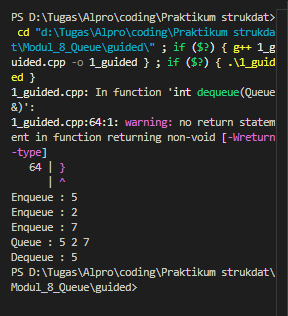
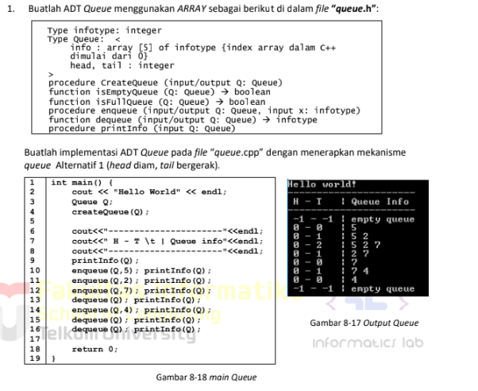
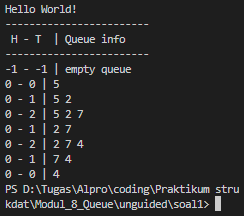
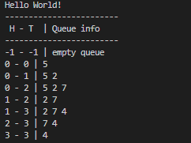
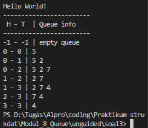

# <h1 align="center"> Laporan Praktikum Modul 8 <br> Queue </h1>
<p align="center">Rafi Maheswara - 103112400135</p>

## Dasar Teori

Queue adalah struktur data linear yang bekerja dengan prinsip FIFO (First In, First Out), artinya data yang pertama kali masuk akan menjadi yang pertama keluar.Prinsip ini adalah kebalikan dari Stack; operasi utamanya meliputi enqueue untuk menambahkan elemen di bagian belakang (rear) dan dequeue untuk menghapus elemen dari bagian depan (front). Dalam C++, Queue dapat dibangun secara manual menggunakan array atau linked list.

## Guided

### soal 1 

```C++
#include <iostream>
using namespace std;
#define MAX 100

struct Queue {
    int data[MAX];
    int head;
    int tail;
}; 

void createQueue(Queue &Q) {
    Q.head = -1;
    Q.tail = -1;
}

bool isEmpty(Queue Q) {
    return (Q.head == -1 && Q.tail == -1);
}

bool isFull(Queue Q) {
    return (Q.tail == MAX - 1);
}

void printQueue(Queue Q) {
    if (isEmpty(Q)) {
        cout << "Queue kosong!" << endl;
    } else {
        cout << "Queue : ";
        for (int i = Q.head; i <= Q.tail; i++) {
            cout << Q.data[i] << " ";
        }
        cout << endl;
    }
}

void enqueue(Queue &Q, int x) {
    if (isFull(Q)) {
        cout << "Queue penuh!" << endl;
    } else {
        if (isEmpty(Q)) {
            Q.head = Q.tail = 0;
        } else {
            Q.tail++;
        }
        Q.data[Q.tail] = x;
        cout << "Enqueue : " << x << endl;
    }
}

int dequeue(Queue &Q) {
    if (isEmpty(Q)) {
        cout << "Queue kosong!" << endl; 
    } else {
        cout << "Dequeue : " << Q.data[Q.head] << endl;
        if (Q.head == Q.tail) {
            Q.head = Q.tail = -1; 
        } else {
            for (int i = Q.head; i < Q.tail; i++) {
                Q.data[i] = Q.data[i + 1];
            }
            Q.tail--;
        }
    }
}

int main() {
    Queue Q;
    createQueue(Q);
    
    enqueue(Q, 5);
    enqueue(Q, 2);
    enqueue(Q, 7);
    printQueue(Q);
    
    dequeue(Q);
    printQueue(Q);
    
    enqueue(Q, 4);
    enqueue(Q, 9);
    printQueue(Q);
    
    dequeue(Q);
    dequeue(Q);
    dequeue(Q);
    printQueue(Q);
    
    return 0;
}

```
> 
Program mengisi antrian dengan angka 5, 2, dan 7, lalu mengambil angka 5 yang menyebabkan sisa data bergeser maju menjadi "2 7". Setelah menambahkan angka 4 dan 9, tiga angka terdepan kembali diambil berturut-turut. Hasil akhirnya, antrian hanya menyisakan angka 9.

## Unguided

### Soal 1

> 

#### queue.h
```C++
#ifndef QUEUE_H
#define QUEUE_H

#include <iostream>
using namespace std;

const int MAX = 5;

typedef int infotype;

struct Queue {
    infotype info[MAX];
    int head;
    int tail;
};

void createQueue(Queue &Q);
bool isEmptyQueue(const Queue &Q);
bool isFullQueue(const Queue &Q);
void enqueue(Queue &Q, infotype x);
infotype dequeue(Queue &Q);
void printInfo(const Queue &Q);

#endif
```

#### queue.cpp
```C++
#include "queue.h"

void createQueue(Queue &Q) {
    Q.head = -1;
    Q.tail = -1;
}

bool isEmptyQueue(const Queue &Q) {
    return (Q.head == -1 && Q.tail == -1);
}

bool isFullQueue(const Queue &Q) {
    return (Q.tail == MAX - 1);
}

void enqueue(Queue &Q, infotype x) {
    if (isFullQueue(Q)) {
        cout << "Queue Penuh!" << endl;
    } else {
        if (isEmptyQueue(Q)) {
            Q.head = 0;
            Q.tail = 0;
        } else {
            Q.tail++;
        }
        Q.info[Q.tail] = x;
    }
}

infotype dequeue(Queue &Q) {
    infotype val = -1;
    if (isEmptyQueue(Q)) {
        cout << "Queue Kosong!" << endl;
    } else {
        val = Q.info[Q.head];  
        for (int i = 0; i < Q.tail; i++) {
            Q.info[i] = Q.info[i + 1];
        }
        Q.tail--;
        
        if (Q.tail == -1) {
            Q.head = -1;
        }
    }
    return val;
}
void printInfo(const Queue &Q) {
    if (isEmptyQueue(Q)) {
        cout << -1 << " - " << -1 << " | empty queue" << endl;
    } else {
        cout << Q.head << " - " << Q.tail << " | ";
        for (int i = Q.head; i <= Q.tail; i++) {
            cout << Q.info[i] << " ";
        }
        cout << endl;
    }
}
```

#### main.cpp
```C++
#include <iostream>
#include "queue.h"

using namespace std;

int main() {
    cout << "Hello World" << endl;
    
    Queue Q;
    createQueue(Q);
    
    cout << "------------------------" << endl;
    cout << " H - T  | Queue info" << endl;
    cout << "------------------------" << endl;
    
    printInfo(Q);
    
    enqueue(Q, 5); printInfo(Q);
    enqueue(Q, 2); printInfo(Q);
    enqueue(Q, 7); printInfo(Q);
    
    dequeue(Q);    printInfo(Q);
    
    enqueue(Q, 4); printInfo(Q);
    
    dequeue(Q);    printInfo(Q); 
    dequeue(Q);    printInfo(Q); 
    
    return 0;
}
```

> Output
> 

Program dimulai dengan antrian kosong, lalu diisi angka 5, 2, dan 7 secara berurutan. Saat dequeue dilakukan untuk mengambil angka 5, elemen tersisa (2 dan 7) langsung digeser maju ke posisi awal, menjaga indikator Head tetap diam di indeks 0. Setelah angka 4 masuk dan terjadi dua kali dequeue berikutnya, pergeseran kembali terjadi. Intinya, setiap pengambilan data memaksa seluruh elemen sisa bergeser ke kiri agar posisi Head selalu tetap di indeks 0.

### Soal 2

Buatlah implementasi ADT Queue pada file “queue.cpp” dengan menerapkan mekanisme queue Alternatif 2 (head bergerak, tail bergerak).

#### queue.h
```C++
#ifndef QUEUE_H
#define QUEUE_H

#include <iostream>
using namespace std;

const int MAX = 5;

typedef int infotype;

struct Queue {
    infotype info[MAX];
    int head;
    int tail;
};

void createQueue(Queue &Q);
bool isEmptyQueue(const Queue &Q);
bool isFullQueue(const Queue &Q);
void enqueue(Queue &Q, infotype x);
infotype dequeue(Queue &Q);
void printInfo(const Queue &Q);

#endif
```

#### queue.cpp
```C++
#include "queue.h"

void createQueue(Queue &Q) {
    Q.head = -1;
    Q.tail = -1;
}

bool isEmptyQueue(const Queue &Q) {
    return (Q.head == -1 && Q.tail == -1);
}
bool isFullQueue(const Queue &Q) {
    return (Q.tail == MAX - 1);
}

void enqueue(Queue &Q, infotype x) {
    if (isFullQueue(Q)) {
        cout << "Queue Penuh!" << endl;
    } else {
        if (isEmptyQueue(Q)) {
            Q.head = 0;
            Q.tail = 0;
        } else {
            Q.tail++;
        }
        Q.info[Q.tail] = x;
    }
}

infotype dequeue(Queue &Q) {
    infotype val = -1; 
    if (isEmptyQueue(Q)) {
        cout << "Queue Kosong!" << endl;
    } else {
        val = Q.info[Q.head];
        if (Q.head == Q.tail) {
            createQueue(Q); 
        } else {
            Q.head++; 
        }
    }
    return val;
}

void printInfo(const Queue &Q) {
    if (isEmptyQueue(Q)) {
        cout << -1 << " - " << -1 << " | empty queue" << endl;
    } else {
        cout << Q.head << " - " << Q.tail << " | ";
        
        for (int i = Q.head; i <= Q.tail; i++) {
            cout << Q.info[i] << " ";
        }
        cout << endl;
    }
}
```

#### main.cpp
```C++
#include <iostream>
#include "queue.h"

using namespace std;

int main() {
    cout << "Hello World!" << endl;
    
    Queue Q;
    createQueue(Q);
    
    cout << "------------------------" << endl;
    cout << " H - T  | Queue info" << endl;
    cout << "------------------------" << endl;
    
    printInfo(Q);
    
    enqueue(Q, 5); printInfo(Q);
    enqueue(Q, 2); printInfo(Q);
    enqueue(Q, 7); printInfo(Q);
    
    dequeue(Q);    printInfo(Q); 
    
    enqueue(Q, 4); printInfo(Q);
    
    dequeue(Q);    printInfo(Q);
    dequeue(Q);    printInfo(Q); 
    
    return 0;
}
```

> Output
> 

Program tersebut menampilkan riwayat status antrian (queue) langkah demi langkah, mulai dari kosong hingga terisi dan kosong kembali. Kolom H (Head) terlihat selalu bernilai 0 saat ada isinya, yang membuktikan mekanisme "Head Diam" bekerja: setiap kali angka terdepan diambil (dequeue), angka-angka sisanya langsung bergeser maju mengisi indeks ke-0. Sebaliknya, kolom T (Tail) bergerak naik saat data ditambahkan (enqueue) dan turun saat data diambil, menggambarkan antrian yang memanjang dan memendek secara dinamis namun tetap terpaku di posisi awal array.

### Soal 3

Buatlah implementasi ADT Queue pada file “queue.cpp” dengan menerapkan mekanisme queue Alternatif 3 (head dan tail berputar).

#### queue.h
```C++
#ifndef QUEUE_H
#define QUEUE_H

#include <iostream>
using namespace std;

const int MAX = 5;

typedef int infotype;

struct Queue {
    infotype info[MAX];
    int head;
    int tail;
};

void createQueue(Queue &Q);
bool isEmptyQueue(const Queue &Q);
bool isFullQueue(const Queue &Q);
void enqueue(Queue &Q, infotype x);
infotype dequeue(Queue &Q);
void printInfo(const Queue &Q);

#endif
```

#### queue.cpp
```C++
#include "queue.h"

void createQueue(Queue &Q) {
    Q.head = -1;
    Q.tail = -1;
}

bool isEmptyQueue(const Queue &Q) {
    return (Q.head == -1 && Q.tail == -1);
}
bool isFullQueue(const Queue &Q) {
    return ((Q.tail + 1) % MAX == Q.head);
}

void enqueue(Queue &Q, infotype x) {
    if (isFullQueue(Q)) {
        cout << "Queue Penuh!" << endl;
    } else {
        if (isEmptyQueue(Q)) {
            Q.head = 0;
            Q.tail = 0;
        } else {
            Q.tail = (Q.tail + 1) % MAX;
        }
        Q.info[Q.tail] = x;
    }
}

infotype dequeue(Queue &Q) {
    infotype val = -1;
    if (isEmptyQueue(Q)) {
        cout << "Queue Kosong!" << endl;
    } else {
        val = Q.info[Q.head]; 
        
        if (Q.head == Q.tail) {
            createQueue(Q);
        } else {
            Q.head = (Q.head + 1) % MAX;
        }
    }
    return val;
}

void printInfo(const Queue &Q) {
    if (isEmptyQueue(Q)) {
        cout << -1 << " - " << -1 << " | empty queue" << endl;
    } else {
        cout << Q.head << " - " << Q.tail << " | ";
        int i = Q.head;
        while (true) {
            cout << Q.info[i] << " ";
            
            if (i == Q.tail) break;
            
            i = (i + 1) % MAX; 
        }
        cout << endl;
    }
}
```

#### main.cpp
```C++
#include <iostream>
#include "queue.h"

using namespace std;

int main() {
    cout << "Hello World!" << endl;
    
    Queue Q;
    createQueue(Q);
    
    cout << "------------------------" << endl;
    cout << " H - T  | Queue info" << endl;
    cout << "------------------------" << endl;
    
    printInfo(Q);
    
    enqueue(Q, 5); printInfo(Q);
    enqueue(Q, 2); printInfo(Q);
    enqueue(Q, 7); printInfo(Q);
    
    dequeue(Q);    printInfo(Q); 
    
    enqueue(Q, 4); printInfo(Q);
    
    dequeue(Q);    printInfo(Q);
    dequeue(Q);    printInfo(Q); 
    
    return 0;
}
```

> Output
> 

program ini menunjukkan nilai H (Head) dan T (Tail) yang sama-sama bergerak maju (tidak diam di 0). Ciri khas utamanya adalah indikator T akan kembali ke 0 secara otomatis setelah mencapai batas indeks terakhir, asalkan ada ruang kosong di depan.
## Referensi

1. Juliansyah, N., Sari, S. Y., & Dristyan, F. (2024). Optimasi Struktur Data Stack dan Queue Menggunakan Array Dinamis. Fusion: Journal of Research in Engineering, Technology and Applied Sciences, 1(2), 90-97. https://ejurnal.faaslibsmedia.com/index.php/fusion/article/view/264
2. Anita Sindar, R. M. S. (2019). Struktur Data Dan Algoritma Dengan C++ (Vol. 1). CV. AA. RIZKY. https://books.google.com/books?hl=en&lr=&id=GP_ADwAAQBAJ&oi=fnd&pg=PA23&dq=stack+pada+c%2B%2B&ots=86k4Nl2OhV&sig=0KNR8rE2WYaLliEAZmi71x2eU7k
3. Santoso, L. E. (2004). STANDARD TEMPLATE LIBRARY C++ UNTUK MENGAJARKAN STRUKTUR DATA. Jurnal FASILKOM Vol, 2(2). https://www.academia.edu/download/56411324/standard-template-library-c__-untuk-mengajarkan-struktur-data.pdf